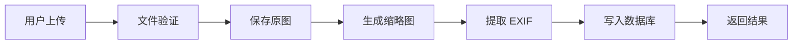

# 照片收录管理系统 - 所有阶段设计要点汇总

## 概述

本文档汇总了照片收录管理系统全部 9 个实施阶段的核心设计要点、技术选型和关键决策。每个阶段的详细文档请参考各自的子目录。

---

## 阶段 1: 基础设施搭建 ✅

### 核心技术决策
- **Monorepo 结构**: 前后端代码在同一仓库，便于管理
- **Docker 容器化**: 所有服务容器化，一键启动
- **开发环境配置**: 热重载支持，开发体验优先

### 关键组件
| 组件 | 技术选型 | 端口 | 说明 |
|------|---------|------|------|
| 前端 | Vue 3 + Vite | 5173 | TypeScript + Tailwind CSS |
| 后端 | FastAPI | 8000 | Python 3.11+ 异步框架 |
| 数据库 | MongoDB 7.0 | 27017 | NoSQL 文档数据库 |
| 反向代理 | Nginx | 80 | 统一入口 |

### 文件结构
```
apps/web/        # Vue 3 前端
apps/api/        # FastAPI 后端
infrastructure/  # Docker 配置
storage/         # 本地文件存储
```

### 验收标准
- ✅ `docker-compose up -d` 一键启动所有服务
- ✅ API 健康检查 `/health` 返回 200
- ✅ 前端页面可访问 localhost:5173
- ✅ MongoDB 连接成功

---

## 阶段 2: 认证系统

### 核心技术决策
- **JWT 认证**: 无状态令牌认证
- **bcrypt 密码哈希**: 成本因子 12
- **Token 过期**: 24 小时自动过期

### 关键组件
| 组件 | 文件路径 | 职责 |
|------|---------|------|
| User 模型 | apps/api/app/models/user.py | 管理员用户数据模型 |
| 安全工具 | apps/api/app/core/security.py | JWT 生成/验证, 密码哈希 |
| 认证端点 | apps/api/app/api/v1/auth.py | POST /auth/login |
| 认证中间件 | apps/api/app/api/deps.py | 保护管理员路由 |
| Auth Store | apps/web/src/stores/auth.ts | 前端认证状态管理 |
| 登录页面 | apps/web/src/pages/AdminLogin.vue | 管理员登录界面 |

### API 端点设计
```
POST /api/v1/auth/login
Request: { username, password }
Response: { access_token, token_type, expires_in }
```

### 安全措施
- ✅ 密码 bcrypt 哈希存储
- ✅ JWT 包含过期时间
- ✅ 登录端点限流保护（可选）
- ✅ Token 存储在 localStorage
- ✅ 路由守卫保护管理页面

---

## 阶段 3: 收录码管理

### 核心技术决策
- **收录码格式**: 6 位字母数字 (大小写不敏感)
- **生成策略**: 随机生成 + 唯一性检查
- **组合空间**: 36^6 ≈ 22 亿种组合

### 关键组件
| 组件 | 文件路径 | 职责 |
|------|---------|------|
| Collection 模型 | apps/api/app/models/collection.py | 收录码数据模型 |
| 收录码生成器 | apps/api/app/utils/code_generator.py | 生成唯一 6 位码 |
| 收录码服务 | apps/api/app/services/collection_service.py | 业务逻辑层 |
| 收录码端点 | apps/api/app/api/v1/collections.py | 验证端点 |
| 管理端点 | apps/api/app/api/v1/admin.py | CRUD 端点（管理员） |
| 收录码输入页 | apps/web/src/pages/AccessCodePage.vue | 用户输入界面 |
| 收录码管理表单 | apps/web/src/components/admin/CollectionForm.vue | 创建/编辑界面 |

### MongoDB Schema
```javascript
collections {
  _id: ObjectId,
  code: String (unique, 6位字母数字),
  name: String,
  description: String,
  status: "active" | "archived" | "closed",
  settings: {
    allow_upload: Boolean,
    max_file_size: Number,
    allowed_extensions: [String]
  },
  statistics: {
    total_photos: Number,
    total_size_bytes: Number,
    last_upload_at: Date
  },
  created_at: Date,
  created_by: String
}
```

### API 端点设计
```
# 用户端
POST /api/v1/collections/validate
Request: { code: "ABC123" }
Response: { valid: true, collection: {...} }

# 管理端（需认证）
POST /api/v1/admin/collections
GET /api/v1/admin/collections?page=1&limit=20
GET /api/v1/admin/collections/{code}
PATCH /api/v1/admin/collections/{code}
DELETE /api/v1/admin/collections/{code}
```

---

## 阶段 4: 照片上传系统

### 核心技术决策
- **文件存储**: 本地文件系统 (可扩展到 S3)
- **存储路径**: `storage/uploads/{collection_code}/{year}/{month}/{uuid}_{filename}`
- **缩略图**: Pillow 生成 400x400 缩略图
- **文件验证**: 魔术数字检查 + MIME 类型验证

### 关键组件
| 组件 | 文件路径 | 职责 |
|------|---------|------|
| Photo 模型 | apps/api/app/models/photo.py | 照片数据模型 |
| 存储服务 | apps/api/app/services/storage_service.py | 文件存储抽象层 |
| 图片处理服务 | apps/api/app/services/image_service.py | Pillow 缩略图生成 |
| 照片服务 | apps/api/app/services/photo_service.py | 照片业务逻辑 |
| 上传端点 | apps/api/app/api/v1/photos.py | multipart/form-data |
| 拖拽上传组件 | apps/web/src/components/upload/FileDropZone.vue | 拖拽区域 |
| 上传进度组件 | apps/web/src/components/upload/UploadProgress.vue | 进度条 |
| 上传页面 | apps/web/src/pages/UploadPage.vue | 用户上传界面 |

### MongoDB Schema
```javascript
photos {
  _id: ObjectId,
  collection_code: String (索引),
  filename: String,
  file_path: String,
  thumbnail_path: String,
  file_size: Number,
  mime_type: String,
  dimensions: { width: Number, height: Number },
  uploaded_at: Date (索引),
  uploader_info: {
    ip_address: String,
    user_agent: String
  },
  metadata: {
    exif_data: Object,
    camera_make: String,
    camera_model: String
  },
  processing_status: "pending" | "processed" | "failed",
  is_deleted: Boolean
}
```

### API 端点设计
```
POST /api/v1/collections/{code}/photos
Content-Type: multipart/form-data
Request: FormData { files: File[] }
Response: {
  uploaded: [{ id, filename, status }],
  failed: []
}
```

### 文件处理流程


---

## 阶段 5: 管理后台界面设计 ⭐ 重点

### 核心技术决策
- **UI 框架**: Tailwind CSS (utility-first)
- **图标库**: Heroicons 或 Lucide (不使用 emoji)
- **设计风格**: 现代化管理后台 (Dashboard/Admin Panel)
- **配色方案**: 专业清爽（蓝色主调）
- **UI/UX 设计工具**: ui-ux-pro-max 技能指导

### UI 组件设计规范

#### 1. 统计卡片 (StatCard)
```vue
<StatCard
  title="总收录码"
  value="128"
  icon="collection"
  trend="+12%"
  trendUp
/>
```
- 白色背景，圆角 8px
- Subtle 阴影
- Hover 效果：阴影增强

#### 2. 照片网格 (PhotoGrid)
```
响应式网格: grid-cols-2 md:grid-cols-4 lg:grid-cols-6
每个照片卡片:
  - 缩略图 (1:1 宽高比)
  - 左上角复选框
  - Hover 遮罩层（文件名、大小）
  - 右上角快速下载按钮
```

#### 3. 照片工具栏 (PhotoToolbar)
```
位置: Sticky top
功能:
  - 全选 / 取消全选
  - 已选数量显示
  - 批量下载按钮
  - 一键下载全部按钮
  - 删除选中按钮
  - 一键删除全部按钮（需二次确认）
背景: glassmorphism (半透明白色模糊)
```

#### 4. 灯箱 (Lightbox)
```
背景: 全屏黑色半透明 (rgba(0,0,0,0.9))
图片: 居中显示，最大化利用空间
顶部工具栏: 文件名 + 关闭按钮
底部工具栏: 下载 + 删除按钮
导航: 左右箭头按钮
键盘: ESC 关闭，← → 切换
```

### 关键组件
| 组件 | 文件路径 | 职责 |
|------|---------|------|
| 管理首页 | apps/web/src/pages/AdminDashboard.vue | 统计 + 收录码列表 |
| 收录码详情页 | apps/web/src/pages/AdminCollectionDetail.vue | 照片管理 |
| 照片网格 | apps/web/src/components/admin/PhotoGrid.vue | 响应式网格展示 |
| 照片卡片 | apps/web/src/components/admin/PhotoCard.vue | 单张照片卡片 |
| 灯箱 | apps/web/src/components/admin/Lightbox.vue | 全屏查看 |
| 照片工具栏 | apps/web/src/components/admin/PhotoToolbar.vue | 批量操作 |
| 统计卡片 | apps/web/src/components/admin/StatCard.vue | 数据展示 |
| 收录码卡片 | apps/web/src/components/admin/CollectionCard.vue | 收录码展示 |

### API 端点设计（管理员专用）
```
# 照片列表
GET /api/v1/admin/collections/{code}/photos?page=1&limit=50

# 单张下载
GET /api/v1/admin/photos/{photo_id}/download

# 批量下载
POST /api/v1/admin/collections/{code}/photos/download
Request: { photo_ids: ["id1", "id2"] }
Response: Stream ZIP

# 一键下载全部
POST /api/v1/admin/collections/{code}/photos/download-all
Response: Stream ZIP

# 删除单张
DELETE /api/v1/admin/photos/{photo_id}

# 一键删除全部
DELETE /api/v1/admin/collections/{code}/photos
Response: { success: true, deleted_count: 100 }
```

### 设计检查清单
- [ ] 使用 ui-ux-pro-max 搜索设计指导
- [ ] 统一配色方案（Tailwind 配置）
- [ ] 所有交互元素有 hover/active 状态
- [ ] 使用 SVG 图标（Heroicons/Lucide）
- [ ] 所有可点击元素 `cursor-pointer`
- [ ] 响应式布局（移动/平板/桌面）
- [ ] 灯箱支持键盘导航
- [ ] 危险操作二次确认
- [ ] 加载状态友好（骨架屏）
- [ ] 空状态有引导提示

---

## 阶段 6: 统计与数据展示

### 核心功能
- 总收录码数量
- 总照片数量
- 总存储空间
- 最近上传照片列表
- 收录码活跃度统计

### API 端点设计
```
GET /api/v1/admin/statistics
Response: {
  total_collections: 128,
  total_photos: 5420,
  total_storage_bytes: 2147483648,
  active_collections: 98,
  recent_uploads: [...]
}
```

---

## 阶段 7: 搜索筛选与优化

### 核心功能
- 文件名搜索
- 日期范围筛选
- 数据库索引优化
- 图片懒加载
- 虚拟滚动（大列表）

### 性能优化指标
- 首屏加载 < 2秒
- 图片懒加载节省 60% 初始带宽
- 虚拟滚动支持 1000+ 照片流畅滚动

---

## 阶段 8: 测试与文档

### 测试覆盖目标
- 后端单元测试覆盖率 > 80%
- 前端组件测试覆盖率 > 70%
- E2E 测试覆盖关键用户流程

### 文档清单
- [ ] API 文档（FastAPI 自动生成）
- [ ] 用户手册（上传流程）
- [ ] 管理员手册（后台操作）
- [ ] 部署指南（Docker 部署）
- [ ] README.md（快速开始）

---

## 阶段 9: 生产部署

### 核心配置
- **生产 Dockerfile**: 多阶段构建，优化镜像大小
- **Nginx HTTPS**: Let's Encrypt SSL 证书
- **数据备份**: MongoDB 定期备份脚本
- **日志监控**: 集中式日志收集

### 环境变量
```
# 生产环境
ENVIRONMENT=production
MONGODB_URL=mongodb://...
JWT_SECRET=random-secret-key
S3_BUCKET=photo-bucket (可选)
```

### 部署清单
- [ ] 生产 docker-compose.prod.yml
- [ ] Nginx HTTPS 配置
- [ ] MongoDB 备份脚本
- [ ] 环境变量模板
- [ ] 监控告警配置

---

## 核心技术架构总结

### 前端架构
```
Vue 3 (Composition API)
  ├── Router (页面路由)
  ├── Pinia (状态管理)
  ├── Services (API 调用)
  ├── Components
  │   ├── Common (通用组件)
  │   ├── Upload (上传组件)
  │   └── Admin (管理组件)
  └── Composables (可复用逻辑)
```

### 后端架构
```
FastAPI
  ├── API Layer (路由端点)
  ├── Service Layer (业务逻辑)
  ├── Repository Layer (数据访问)
  ├── Models (数据模型)
  └── Core (配置/数据库/安全)
```

### 数据流
```
用户 -> Nginx -> Vue 3 -> API -> Service -> Repository -> MongoDB
                                  ↓
                            Storage (本地/S3)
```

---

## 关键决策记录

### 1. 为什么选择 MongoDB 而不是 PostgreSQL？
- **文档型数据**: 照片元数据结构灵活（EXIF 数据不固定）
- **水平扩展**: 未来可以方便地分片扩展
- **开发效率**: Schema-less 快速迭代

### 2. 为什么使用本地存储而不是直接用 S3？
- **降低初期成本**: 小规模部署无需云存储
- **简化配置**: 开发环境无需 AWS 账号
- **易于扩展**: 存储服务抽象层，随时可切换到 S3

### 3. 为什么不实现用户注册功能？
- **简化流程**: 用户无需注册即可上传
- **收录码即权限**: 知道收录码即可上传
- **管理员手动创建**: 防止滥用

### 4. 为什么重点美化管理后台而不是用户端？
- **核心用户**: 管理员是主要使用者
- **操作频率**: 管理员需要频繁操作后台
- **功能复杂度**: 后台功能多，需要好的 UX

---

**文档版本**: 1.0
**创建时间**: 2026-01-13
**最后更新**: 2026-01-13
