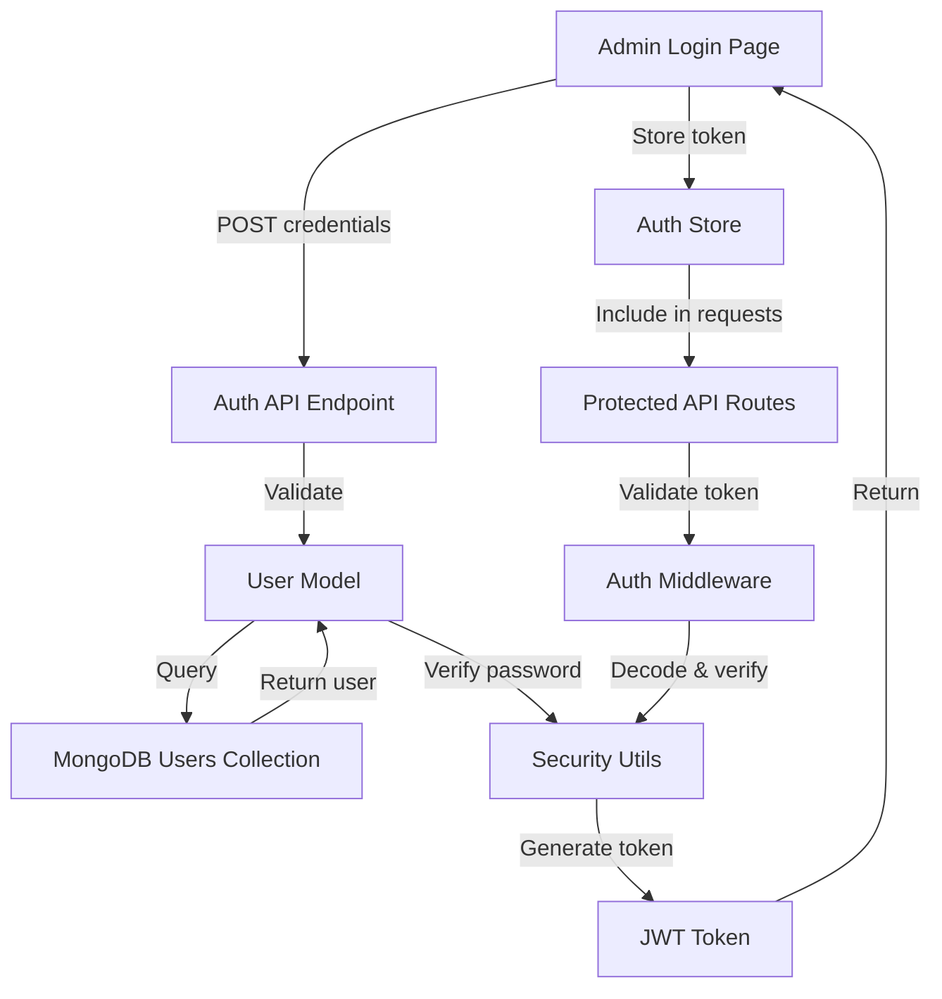

# Design Document - Phase 2: Authentication System

## Overview

This design implements a JWT-based authentication system for the photo collection management platform. The system provides secure login, token-based session management, and route protection for administrative functions. The architecture follows a layered approach with clear separation between security utilities, data models, API endpoints, and frontend components.

## Steering Document Alignment

### Technical Standards
- **Backend Framework**: FastAPI with async/await patterns
- **Database**: MongoDB for user storage
- **Security**: JWT tokens with bcrypt password hashing
- **Frontend**: Vue 3 with Composition API and Pinia for state management

### Project Structure
- Backend authentication logic in `apps/api/app/core/security.py`
- User model in `apps/api/app/models/user.py`
- Auth endpoints in `apps/api/app/api/v1/auth.py`
- Auth middleware in `apps/api/app/api/deps.py`
- Frontend auth store in `apps/web/src/stores/auth.ts`
- Login page in `apps/web/src/pages/AdminLogin.vue`

## Code Reuse Analysis

### Existing Components to Leverage
- **MongoDB Connection**: Reuse existing database connection from Phase 1 (`apps/api/app/core/database.py`)
- **FastAPI App Instance**: Extend existing API router structure
- **Vue Router**: Add authentication guards to existing router configuration
- **Pinia Store**: Follow existing store patterns for state management

### Integration Points
- **Database**: Add `users` collection to existing MongoDB instance
- **API Routes**: Mount auth endpoints under `/api/v1/auth`
- **Frontend Router**: Add route guards to protect admin pages
- **Environment Config**: Add JWT secret to existing `.env` configuration

## Architecture

### System Architecture



### Modular Design Principles
- **Single File Responsibility**:
  - `security.py`: JWT and password utilities only
  - `user.py`: User data model only
  - `auth.py`: Login endpoint only
  - `deps.py`: Authentication dependency injection
- **Component Isolation**: Frontend auth logic isolated in dedicated store
- **Service Layer Separation**: Clear separation between API, business logic, and data access
- **Utility Modularity**: Security functions are pure and reusable

## Components and Interfaces

### Backend Components

#### 1. Security Utilities (`apps/api/app/core/security.py`)
- **Purpose**: Provide JWT token generation/validation and password hashing
- **Interfaces**:
  - `create_access_token(data: dict) -> str`: Generate JWT token
  - `verify_token(token: str) -> dict`: Decode and validate JWT
  - `hash_password(password: str) -> str`: Hash password with bcrypt
  - `verify_password(plain: str, hashed: str) -> bool`: Verify password
- **Dependencies**: `python-jose[cryptography]`, `passlib[bcrypt]`
- **Reuses**: Environment config for JWT secret

#### 2. User Model (`apps/api/app/models/user.py`)
- **Purpose**: Define user data structure and database operations
- **Interfaces**:
  - `User` Pydantic model with fields: `id`, `username`, `hashed_password`, `created_at`
  - `UserInDB` model extending `User` for database operations
  - `get_user_by_username(username: str) -> User | None`
  - `create_user(username: str, password: str) -> User`
- **Dependencies**: MongoDB motor client, Pydantic
- **Reuses**: Existing database connection patterns

#### 3. Auth Endpoints (`apps/api/app/api/v1/auth.py`)
- **Purpose**: Handle login requests and token generation
- **Interfaces**:
  - `POST /api/v1/auth/login`: Accept credentials, return JWT token
  - Request: `{ username: str, password: str }`
  - Response: `{ access_token: str, token_type: str, expires_in: int }`
- **Dependencies**: User model, security utilities
- **Reuses**: FastAPI router patterns

#### 4. Auth Middleware (`apps/api/app/api/deps.py`)
- **Purpose**: Protect routes with token validation
- **Interfaces**:
  - `get_current_user(token: str = Depends(oauth2_scheme)) -> User`
  - Dependency injection for protected routes
- **Dependencies**: Security utilities, User model
- **Reuses**: FastAPI dependency injection system

### Frontend Components

#### 5. Auth Store (`apps/web/src/stores/auth.ts`)
- **Purpose**: Manage authentication state and token storage
- **Interfaces**:
  - `login(username: string, password: string): Promise<void>`
  - `logout(): void`
  - `isAuthenticated: ComputedRef<boolean>`
  - `token: Ref<string | null>`
- **Dependencies**: Pinia, axios
- **Reuses**: Existing API service patterns

#### 6. Login Page (`apps/web/src/pages/AdminLogin.vue`)
- **Purpose**: Provide login UI for administrators
- **Interfaces**:
  - Form with username and password inputs
  - Submit button with loading state
  - Error message display
- **Dependencies**: Auth store, Vue Router
- **Reuses**: Tailwind CSS styling patterns

#### 7. Route Guards (`apps/web/src/router/index.ts`)
- **Purpose**: Protect admin routes from unauthenticated access
- **Interfaces**:
  - `beforeEach` navigation guard checking authentication
  - Redirect to login if not authenticated
- **Dependencies**: Auth store, Vue Router
- **Reuses**: Existing router configuration

## Data Models

### User Model (MongoDB)
```javascript
{
  _id: ObjectId,
  username: String (unique, indexed),
  hashed_password: String,
  created_at: Date,
  updated_at: Date
}
```

### JWT Token Payload
```javascript
{
  sub: String (user_id),
  username: String,
  exp: Number (expiration timestamp),
  iat: Number (issued at timestamp)
}
```

### API Request/Response Models

**Login Request**:
```typescript
{
  username: string,
  password: string
}
```

**Login Response**:
```typescript
{
  access_token: string,
  token_type: "bearer",
  expires_in: number
}
```

## Error Handling

### Error Scenarios

1. **Invalid Credentials**
   - **Handling**: Return 401 with generic message "Invalid credentials"
   - **User Impact**: Login form shows error, no username enumeration

2. **Expired Token**
   - **Handling**: Return 401 with "Token expired" message
   - **User Impact**: Frontend redirects to login page

3. **Malformed Token**
   - **Handling**: Return 401 with "Invalid token" message
   - **User Impact**: Frontend redirects to login page

4. **Database Connection Error**
   - **Handling**: Return 500 with generic error message
   - **User Impact**: Login form shows "Service unavailable" error

5. **Missing Token**
   - **Handling**: Return 401 with "Not authenticated" message
   - **User Impact**: Frontend redirects to login page

## Testing Strategy

### Unit Testing
- Test password hashing and verification functions
- Test JWT token generation and validation
- Test user model CRUD operations
- Mock database connections for isolated testing

### Integration Testing
- Test login endpoint with valid/invalid credentials
- Test protected routes with valid/invalid/expired tokens
- Test token refresh flow (if implemented)

### End-to-End Testing
- Test complete login flow from UI to API
- Test session persistence across page refreshes
- Test automatic logout on token expiration
- Test route protection and redirects
