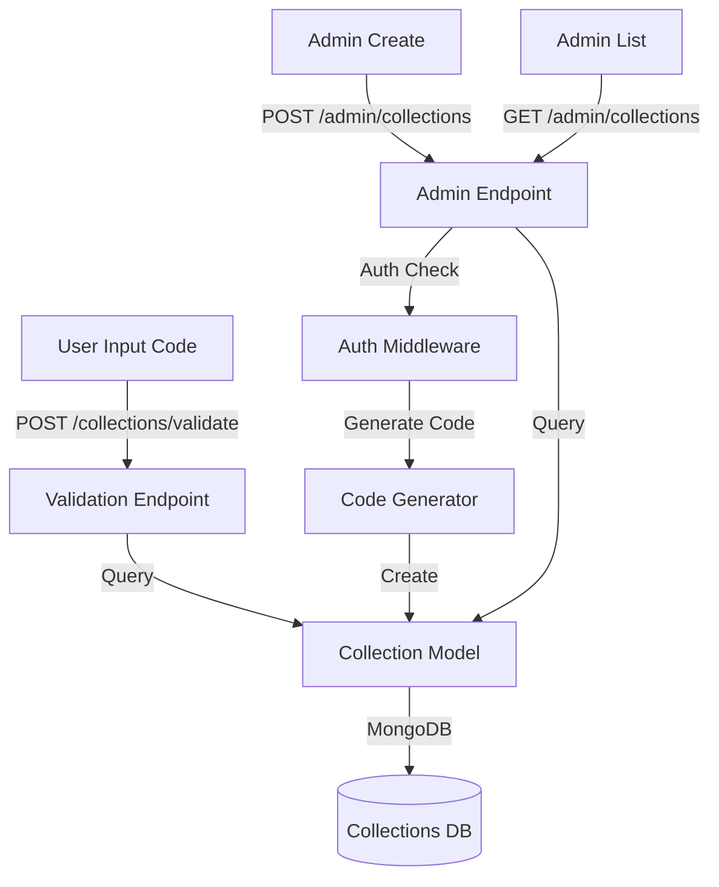

# Design Document - Phase 3: Collection Code Management

## Overview

This design implements the collection code management system, enabling administrators to create and manage unique 6-character codes for photo collection events. The system provides code generation, validation, CRUD operations, and statistics tracking.

## Steering Document Alignment

### Technical Standards
- **Backend Framework**: FastAPI with async/await patterns
- **Database**: MongoDB with indexed code lookups
- **Code Generation**: Cryptographically secure random generation
- **Frontend**: Vue 3 with Composition API

### Project Structure
- Code generator utility in `apps/api/app/utils/code_generator.py`
- Collection model in `apps/api/app/models/collection.py`
- Collection service in `apps/api/app/services/collection_service.py`
- Public validation endpoint in `apps/api/app/api/v1/collections.py`
- Admin CRUD endpoints in `apps/api/app/api/v1/admin.py`
- Frontend code input page in `apps/web/src/pages/AccessCodePage.vue`
- Admin collection management in `apps/web/src/components/admin/CollectionForm.vue`

## Code Reuse Analysis

### Existing Components to Leverage
- **MongoDB Connection**: Reuse database connection from Phase 1
- **Authentication Middleware**: Use auth middleware from Phase 2 for admin endpoints
- **FastAPI Router**: Extend existing API router structure
- **Vue Components**: Follow existing component patterns

### Integration Points
- **Database**: Add `collections` collection to MongoDB
- **API Routes**: Mount collection endpoints under `/api/v1/collections` and `/api/v1/admin/collections`
- **Authentication**: Protect admin endpoints with `get_current_user` dependency

## Architecture



## Components and Interfaces

### Backend Components

#### 1. Code Generator (`apps/api/app/utils/code_generator.py`)
- **Purpose**: Generate unique 6-character alphanumeric codes
- **Interfaces**:
  - `generate_code(length: int = 6) -> str`: Generate random code
  - `generate_unique_code(db, length: int = 6) -> str`: Generate and verify uniqueness
- **Dependencies**: `secrets` module for cryptographic randomness
- **Reuses**: MongoDB connection for uniqueness check

#### 2. Collection Model (`apps/api/app/models/collection.py`)
- **Purpose**: Define collection data structure and database operations
- **Interfaces**:
  - `Collection` Pydantic model
  - `get_collection_by_code(code: str) -> Collection | None`
  - `create_collection(data: CollectionCreate) -> Collection`
  - `update_collection(code: str, data: CollectionUpdate) -> Collection`
  - `delete_collection(code: str) -> bool`
  - `list_collections(skip: int, limit: int) -> List[Collection]`
- **Dependencies**: MongoDB motor client, Pydantic
- **Reuses**: Database connection patterns from Phase 1

#### 3. Collection Service (`apps/api/app/services/collection_service.py`)
- **Purpose**: Business logic for collection management
- **Interfaces**:
  - `validate_code(code: str) -> Collection`
  - `create_collection(data: CollectionCreate) -> Collection`
  - `update_statistics(code: str, photo_size: int) -> None`
- **Dependencies**: Collection model, code generator
- **Reuses**: Existing service layer patterns

## Data Models

### Collection Model (MongoDB)
```javascript
{
  _id: ObjectId,
  code: String (unique, indexed, uppercase),
  name: String,
  description: String,
  status: "active" | "archived" | "closed",
  settings: {
    allow_upload: Boolean,
    max_file_size: Number,
    allowed_extensions: [String]
  },
  statistics: {
    total_photos: Number,
    total_size_bytes: Number,
    last_upload_at: Date
  },
  created_at: Date,
  created_by: String,
  is_deleted: Boolean
}
```

## Error Handling

### Error Scenarios

1. **Invalid Code Format**
   - **Handling**: Return 400 with "Invalid code format"
   - **User Impact**: User sees clear validation error

2. **Code Not Found**
   - **Handling**: Return 404 with "Collection not found"
   - **User Impact**: User prompted to check code

3. **Collection Closed**
   - **Handling**: Return 403 with "Collection is closed"
   - **User Impact**: User informed collection is no longer accepting uploads

4. **Code Collision**
   - **Handling**: Retry generation up to 10 times
   - **User Impact**: Transparent to user

## Testing Strategy

### Unit Testing
- Test code generation and uniqueness verification
- Test collection CRUD operations
- Test statistics update logic

### Integration Testing
- Test validation endpoint with various code states
- Test admin CRUD endpoints with authentication
- Test code collision handling

### End-to-End Testing
- Test user code validation flow
- Test admin collection creation and management
- Test statistics updates during photo uploads
