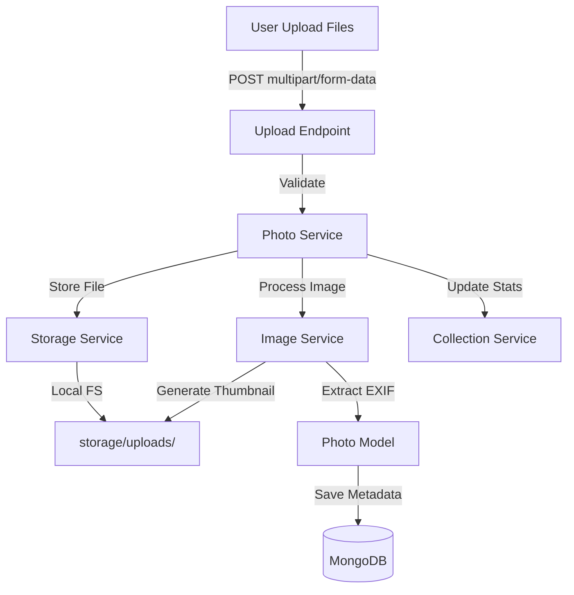

# Design Document - Phase 4: Photo Upload System

## Overview

This design implements the photo upload system with file validation, storage, thumbnail generation, and EXIF metadata extraction. The architecture uses a layered approach with storage abstraction to support future cloud storage migration.

## Steering Document Alignment

### Technical Standards
- **Backend Framework**: FastAPI with async file handling
- **Database**: MongoDB for photo metadata
- **Storage**: Local filesystem (abstracted for future S3 support)
- **Image Processing**: Pillow for thumbnails and EXIF extraction
- **Frontend**: Vue 3 with drag-and-drop upload

### Project Structure
- Photo model in `apps/api/app/models/photo.py`
- Storage service in `apps/api/app/services/storage_service.py`
- Image service in `apps/api/app/services/image_service.py`
- Photo service in `apps/api/app/services/photo_service.py`
- Upload endpoint in `apps/api/app/api/v1/photos.py`
- Upload page in `apps/web/src/pages/UploadPage.vue`
- Upload components in `apps/web/src/components/upload/`

## Code Reuse Analysis

### Existing Components to Leverage
- **MongoDB Connection**: Reuse database connection from Phase 1
- **Collection Service**: Use for validation and statistics updates
- **Vue Components**: Follow existing component patterns
- **API Patterns**: Extend existing FastAPI router structure

### Integration Points
- **Database**: Add `photos` collection to MongoDB
- **Collection Statistics**: Update collection statistics on upload
- **File System**: Store files in `storage/uploads/` directory
- **API Routes**: Mount upload endpoints under `/api/v1/collections/{code}/photos`

## Architecture



## Components and Interfaces

### Backend Components

#### 1. Storage Service (`apps/api/app/services/storage_service.py`)
- **Purpose**: Abstract file storage operations (local/S3)
- **Interfaces**:
  - `save_file(file: UploadFile, path: str) -> str`: Save file and return path
  - `delete_file(path: str) -> bool`: Delete file
  - `get_file_url(path: str) -> str`: Get file URL
- **Dependencies**: `aiofiles` for async file operations
- **Reuses**: Configuration for storage path

#### 2. Image Service (`apps/api/app/services/image_service.py`)
- **Purpose**: Handle image processing (thumbnails, EXIF)
- **Interfaces**:
  - `generate_thumbnail(image_path: str, size: tuple) -> str`: Create thumbnail
  - `extract_exif(image_path: str) -> dict`: Extract EXIF metadata
  - `get_dimensions(image_path: str) -> tuple`: Get image dimensions
- **Dependencies**: Pillow (PIL)
- **Reuses**: Storage service for saving thumbnails

#### 3. Photo Model (`apps/api/app/models/photo.py`)
- **Purpose**: Define photo data structure and database operations
- **Interfaces**:
  - `Photo` Pydantic model
  - `create_photo(data: PhotoCreate) -> Photo`
  - `get_photos_by_collection(code: str, skip: int, limit: int) -> List[Photo]`
  - `delete_photo(photo_id: str) -> bool`
- **Dependencies**: MongoDB motor client
- **Reuses**: Database connection patterns

#### 4. Photo Service (`apps/api/app/services/photo_service.py`)
- **Purpose**: Orchestrate upload workflow
- **Interfaces**:
  - `upload_photos(collection_code: str, files: List[UploadFile]) -> List[Photo]`
  - `validate_file(file: UploadFile, settings: dict) -> bool`
- **Dependencies**: Storage service, Image service, Photo model, Collection service
- **Reuses**: Collection service for validation and statistics

## Data Models

### Photo Model (MongoDB)
```javascript
{
  _id: ObjectId,
  collection_code: String (indexed),
  filename: String,
  file_path: String,
  thumbnail_path: String,
  file_size: Number,
  mime_type: String,
  dimensions: { width: Number, height: Number },
  uploaded_at: Date (indexed),
  uploader_info: {
    ip_address: String,
    user_agent: String
  },
  metadata: {
    exif_data: Object,
    camera_make: String,
    camera_model: String
  },
  processing_status: "pending" | "processed" | "failed",
  is_deleted: Boolean
}
```

## Error Handling

### Error Scenarios

1. **Invalid File Type**
   - **Handling**: Return 400 with "Invalid file type"
   - **User Impact**: File rejected, clear error message

2. **File Too Large**
   - **Handling**: Return 413 with size limit message
   - **User Impact**: File rejected with size limit info

3. **Storage Failure**
   - **Handling**: Return 500, rollback database record
   - **User Impact**: Upload fails, user can retry

4. **Thumbnail Generation Failure**
   - **Handling**: Log error, continue with upload
   - **User Impact**: Photo uploaded without thumbnail

## Testing Strategy

### Unit Testing
- Test file validation logic
- Test thumbnail generation
- Test EXIF extraction
- Mock file system operations

### Integration Testing
- Test complete upload workflow
- Test collection statistics updates
- Test file storage and retrieval

### End-to-End Testing
- Test drag-and-drop upload
- Test multi-file upload
- Test progress tracking
- Test error handling
