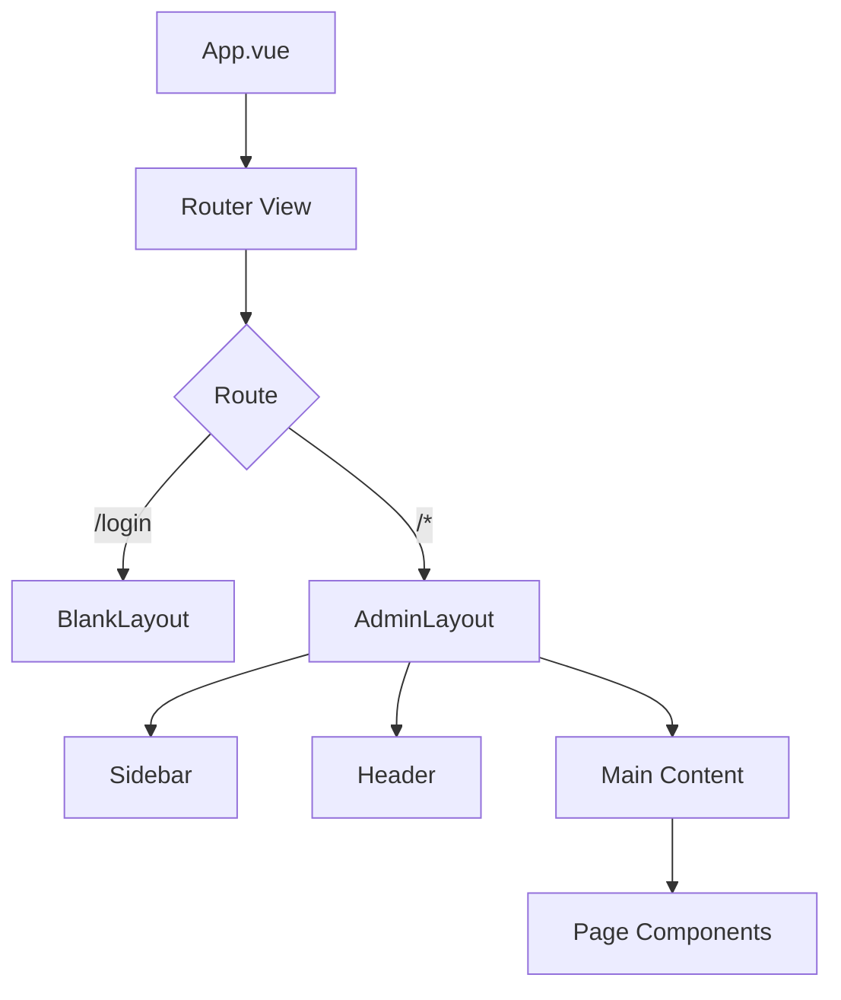
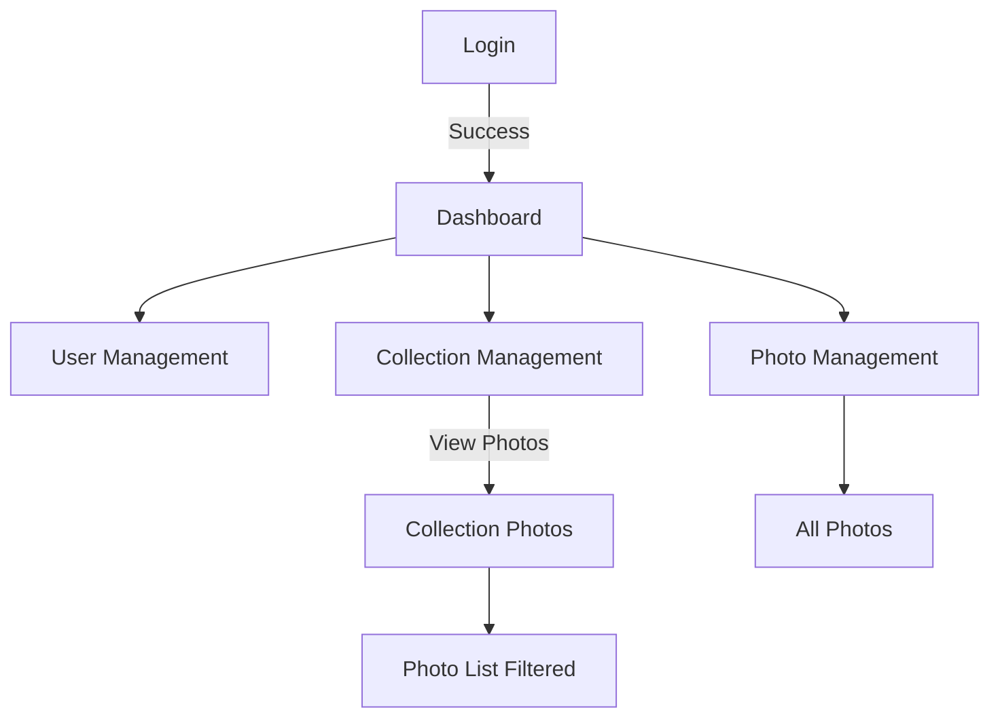
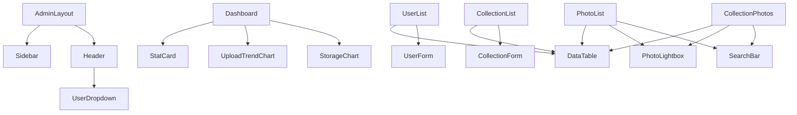

# Design Document - Phase 5: Complete Admin Management System

## Overview

Phase 5 implements a comprehensive admin management system with modern, minimalist design. The system features a unified admin layout with sidebar navigation, and includes dashboard, user management, collection management, and photo management modules. All data is presented in professional data tables with advanced search, filtering, and batch operations.

## Design Philosophy

**Visual Style**: Modern minimalist with professional color scheme
- **Layout**: Dark sidebar (#1e293b) + Light content area (#f8fafc)
- **Primary Color**: Blue (#3b82f6) for actions and highlights
- **Typography**: Clean, readable with proper hierarchy
- **Spacing**: Consistent padding (1rem standard) and margins
- **Components**: Element Plus UI library with Tailwind CSS custom styling

## Steering Document Alignment

### Technical Standards
- **Frontend Framework**: Vue 3.4+ with Composition API
- **Language**: TypeScript 5.3+
- **UI Library**: Element Plus 2.5+
- **Charts**: ECharts 5.4+ with vue-echarts 6.5+
- **Styling**: Tailwind CSS utility-first approach
- **State Management**: Pinia for centralized state
- **Routing**: Vue Router 4+ with nested routes
- **HTTP Client**: Axios 1.6+

### Design Standards
- **Sidebar**: Dark background (#1e293b), 240px width, fixed position
- **Header**: White background, 64px height, fixed position
- **Content Area**: Light background (#f8fafc), max-width 1400px centered
- **Cards**: White background, rounded corners (8px), subtle shadow
- **Tables**: Element Plus tables with custom styling, support for sorting/pagination/selection
- **Forms**: Element Plus forms with validation, consistent spacing
- **Buttons**: Element Plus buttons with semantic colors (primary/success/warning/danger)

## Project Structure

```
apps/admin/src/
├── layouts/
│   ├── AdminLayout.vue          # Main layout (sidebar + header + content)
│   └── BlankLayout.vue          # Blank layout (login page)
├── pages/
│   ├── Dashboard.vue            # Dashboard with statistics and charts
│   ├── Login.vue                # Login page (existing)
│   ├── Settings.vue             # System settings (placeholder)
│   ├── users/
│   │   ├── UserList.vue         # User management list
│   │   └── Profile.vue          # User profile center
│   ├── collections/
│   │   ├── CollectionList.vue   # Collection management list
│   │   ├── CollectionPhotos.vue # Collection photo detail page
│   │   └── CollectionForm.vue   # Collection form dialog
│   └── photos/
│       └── PhotoList.vue        # All photos list
├── components/
│   ├── admin/
│   │   ├── Sidebar.vue          # Sidebar navigation
│   │   ├── Header.vue           # Top header bar
│   │   ├── UserDropdown.vue     # User dropdown menu
│   │   ├── DataTable.vue        # Reusable data table component
│   │   ├── SearchBar.vue        # Search conditions bar
│   │   ├── PhotoLightbox.vue    # Photo preview dialog
│   │   ├── StatCard.vue         # Statistics card
│   │   ├── UploadTrendChart.vue # Upload trend line chart
│   │   └── StorageChart.vue     # Storage distribution pie chart
│   ├── collections/
│   │   └── CollectionCard.vue   # Collection card (existing, reuse)
│   └── users/
│       └── UserForm.vue         # User form dialog
├── stores/
│   ├── auth.ts                  # Authentication store (existing)
│   ├── collections.ts           # Collection store (existing, enhance)
│   ├── users.ts                 # User store (new)
│   └── photos.ts                # Photo store (new)
├── router/
│   └── index.ts                 # Router configuration (update)
└── services/
    ├── api.ts                   # API service (enhance)
    ├── userService.ts           # User API service (new)
    └── photoService.ts          # Photo API service (new)
```

## Architecture

### Layout Architecture



### Page Flow Architecture



### Component Architecture



## Components and Interfaces

### Layout Components

#### 1. AdminLayout (`apps/admin/src/layouts/AdminLayout.vue`)

**Purpose**: Main layout container with sidebar navigation and header

**Features**:
- Fixed sidebar (240px width, dark background)
- Fixed header (64px height, white background)
- Scrollable content area
- Responsive design (mobile hamburger menu)
- User dropdown in header

**Props**: None

**Slots**:
- `default`: Page content

**Dependencies**:
- `Sidebar.vue`
- `Header.vue`
- `UserDropdown.vue`

**Reuses**: Auth store for user info

---

#### 2. Sidebar (`apps/admin/src/components/admin/Sidebar.vue`)

**Purpose**: Left navigation menu with menu items

**Features**:
- Menu items: Dashboard, Users, Collections, Photos, Settings
- Active route highlighting
- Collapsible on mobile
- Logo and title

**Props**: None

**Events**: None

**Dependencies**:
- Vue Router (current route detection)
- Element Plus (`el-menu`)

**Data Structure**:
```typescript
interface MenuItem {
  path: string
  title: string
  icon: string
  hidden?: boolean
}
```

---

#### 3. Header (`apps/admin/src/components/admin/Header.vue`)

**Purpose**: Top header bar with logo and user dropdown

**Features**:
- Logo and system title
- Breadcrumb navigation (optional)
- User dropdown menu (right aligned)
- Responsive behavior

**Props**: None

**Dependencies**:
- `UserDropdown.vue`

---

#### 4. UserDropdown (`apps/admin/src/components/admin/UserDropdown.vue`)

**Purpose**: User dropdown menu with profile and logout

**Features**:
- User avatar (first letter of username)
- Username display
- Dropdown menu items:
  - Profile (navigate to `/profile`)
  - Change Password (navigate or dialog)
  - Settings (disabled placeholder)
  - Divider
  - Logout (with confirmation)

**Props**:
```typescript
interface UserDropdownProps {
  user: {
    username: string
  }
}
```

**Events**:
```typescript
interface UserDropdownEmits {
  logout: () => void
}
```

---

### Dashboard Components

#### 5. StatCard (`apps/admin/src/components/admin/StatCard.vue`)

**Purpose**: Statistics display card for dashboard

**Features**:
- Icon with gradient background
- Title and value display
- Optional trend indicator (percentage up/down)
- Hover effect (slight lift)
- Click handler (optional navigation)

**Props**:
```typescript
interface StatCardProps {
  title: string
  value: string | number
  icon: string
  trend?: number
  trendUp?: boolean
  loading?: boolean
  clickable?: boolean
}
```

**Events**:
```typescript
interface StatCardEmits {
  click: () => void
}
```

**Styling**:
- White background
- Rounded corners (12px)
- Padding: 1.5rem
- Shadow: shadow-sm → shadow-md on hover

---

#### 6. UploadTrendChart (`apps/admin/src/components/admin/UploadTrendChart.vue`)

**Purpose**: Line chart showing upload trend over time

**Features**:
- ECharts line chart
- Time range toggle (7/30/90 days)
- X-axis: Date
- Y-axis: Upload count
- Hover tooltip with values
- Smooth animations

**Props**:
```typescript
interface UploadTrendChartProps {
  data: Array<{
    date: string
    count: number
  }>
  days?: number // 7, 30, or 90
  loading?: boolean
}
```

**Events**:
```typescript
interface UploadTrendChartEmits {
  'update:days': (days: number) => void
  'chart-click': (data: any) => void
}
```

**Dependencies**:
- ECharts 5.4+
- vue-echarts 6.5+

---

#### 7. StorageChart (`apps/admin/src/components/admin/StorageChart.vue`)

**Purpose**: Pie chart showing storage distribution by collection

**Features**:
- ECharts pie chart
- Top 10 collections, others grouped as "Other"
- Click on slice to navigate to collection
- Percentage labels
- Legend on right side

**Props**:
```typescript
interface StorageChartProps {
  data: Array<{
    collection_code: string
    size_bytes: number
    percentage: number
  }>
  loading?: boolean
}
```

**Events**:
```typescript
interface StorageChartEmits {
  'chart-click': (collectionCode: string) => void
}
```

**Dependencies**:
- ECharts 5.4+
- vue-echarts 6.5+

---

### Table Components

#### 8. DataTable (`apps/admin/src/components/admin/DataTable.vue`)

**Purpose**: Reusable data table with advanced features

**Features**:
- Column visibility toggle
- Sorting by column
- Pagination (20/50/100 per page)
- Multi-select with checkboxes
- Fixed action column
- Loading skeleton
- Empty state

**Props**:
```typescript
interface DataTableProps {
  data: Array<any>
  columns: Array<{
    prop: string
    label: string
    width?: number
    sortable?: boolean
    visible?: boolean
    fixed?: boolean
    formatter?: (row: any, column: any, cellValue: any) => string
  }>
  selectable?: boolean
  pagable?: boolean
  loading?: boolean
  pagination?: {
    page: number
    limit: number
    total: number
  }
}
```

**Events**:
```typescript
interface DataTableEmits {
  'selection-change': (selection: any[]) => void
  'sort-change': (sort: { prop: string; order: string }) => void
  'pagination-change': (pagination: { page: number; limit: number }) => void
}
```

**Dependencies**:
- Element Plus (`el-table`)

---

### Search Components

#### 9. SearchBar (`apps/admin/src/components/admin/SearchBar.vue`)

**Purpose**: Search conditions input bar

**Features**:
- Text search input
- Date range picker
- Quick filter buttons (Today, 7 days, 30 days)
- Search and Reset buttons
- Collapsible on mobile

**Props**:
```typescript
interface SearchBarProps {
  searchable?: boolean // Show text input
  dateRange?: boolean // Show date picker
  quickFilters?: boolean // Show quick filter buttons
  loading?: boolean
}
```

**Events**:
```typescript
interface SearchBarEmits {
  search: (params: {
    keyword?: string
    dateRange?: [Date, Date]
  }) => void
  reset: () => void
}
```

**Dependencies**:
- Element Plus (`el-input`, `el-date-picker`, `el-button`)

---

### Photo Components

#### 10. PhotoLightbox (`apps/admin/src/components/admin/PhotoLightbox.vue`)

**Purpose**: Full-screen photo preview dialog

**Features**:
- Full-screen overlay (z-index: 9999)
- Black background (rgba(0,0,0,0.95))
- Centered image (max 90vw x 90vh)
- Bottom action bar: Download, Delete
- ESC key to close
- Loading skeleton
- Error state for failed loads

**Props**:
```typescript
interface PhotoLightboxProps {
  visible: boolean
  photo: {
    id: string
    filename: string
    file_path: string
    dimensions: { width: number; height: number }
  } | null
}
```

**Events**:
```typescript
interface PhotoLightboxEmits {
  'update:visible': (visible: boolean) => void
  download: (photo: any) => void
  delete: (photo: any) => void
}
```

**Keyboard Shortcuts**:
- ESC: Close

---

### Form Components

#### 11. UserForm (`apps/admin/src/components/users/UserForm.vue`)

**Purpose**: User create/edit form dialog

**Features**:
- Form fields: Username, Password, Confirm Password, Role
- Validation rules (username unique, password min 8 chars)
- Mode: Create or Edit
- Success/error messages

**Props**:
```typescript
interface UserFormProps {
  visible: boolean
  mode: 'create' | 'edit'
  user?: {
    id: string
    username: string
    role: string
  }
}
```

**Events**:
```typescript
interface UserFormEmits {
  'update:visible': (visible: boolean) => void
  submit: (data: any) => void
}
```

---

#### 12. CollectionForm (`apps/admin/src/components/collections/CollectionForm.vue`)

**Purpose**: Collection create/edit form dialog (existing, enhance)

**Features**:
- Form fields: Name, Description, Status, Settings (max file size, allowed extensions)
- Auto-generate 6-character code
- Validation rules
- Mode: Create or Edit

**Props**:
```typescript
interface CollectionFormProps {
  visible: boolean
  mode: 'create' | 'edit'
  collection?: Collection
}
```

**Events**:
```typescript
interface CollectionFormEmits {
  'update:visible': (visible: boolean) => void
  submit: (data: any) => void
}
```

---

## Page Components

### Dashboard Page

**File**: `apps/admin/src/pages/Dashboard.vue`

**Features**:
- 4 StatCard components (today's collections, today's photos, today's storage, system overview)
- UploadTrendChart component
- StorageChart component
- Loading states
- Empty states

**Data Flow**:
```typescript
1. Component mounts
2. Fetch statistics from API
3. Update StatCard values
4. Update chart data
5. Handle chart interactions
```

---

### User Management Page

**File**: `apps/admin/src/pages/users/UserList.vue`

**Features**:
- DataTable component with user columns
- SearchBar component (search by username)
- UserForm dialog (create/edit)
- Batch delete functionality
- Pagination

**Columns**:
- Select checkbox
- Username
- Role
- Created at
- Last login
- Actions (Edit, Delete)

**Data Flow**:
```typescript
1. Component mounts
2. Fetch users from API
3. Handle search/filter
4. Handle pagination
5. Handle create/edit/delete
```

---

### Collection Management Page

**File**: `apps/admin/src/pages/collections/CollectionList.vue`

**Features**:
- DataTable component with collection columns
- SearchBar component (search by code, date range)
- CollectionForm dialog (create/edit)
- Batch delete functionality
- Copy code to clipboard
- Download ZIP functionality
- Pagination

**Columns**:
- Select checkbox
- Index
- Collection code (clickable to copy)
- Name
- Status
- Created at
- Photo count
- Updated at
- Actions (View photos, Download, Delete)

**Data Flow**:
```typescript
1. Component mounts
2. Fetch collections from API
3. Handle search/filter
4. Handle pagination
5. Handle create/edit/delete
6. Handle code copy
7. Handle ZIP download
```

---

### Photo Management Pages

#### All Photos Page

**File**: `apps/admin/src/pages/photos/PhotoList.vue`

**Features**:
- DataTable component with photo columns
- SearchBar component (filter by collection, date range)
- PhotoLightbox component
- Batch download/delete functionality
- Pagination

**Columns**:
- Select checkbox
- Index
- Photo preview (80x80 thumbnail, clickable)
- Collection code
- Filename
- File size
- File format
- Uploaded at
- Updated at
- Actions (View, Download, Delete)

**Data Flow**:
```typescript
1. Component mounts
2. Fetch photos from API
3. Handle search/filter
4. Handle pagination
5. Handle thumbnail click → open lightbox
6. Handle batch operations
```

#### Collection Photos Page

**File**: `apps/admin/src/pages/collections/CollectionPhotos.vue`

**Route**: `/collections/:code/photos`

**Features**:
- Collection info header (code, name, stats)
- Back to collections button
- DataTable component (same as All Photos)
- SearchBar component
- PhotoLightbox component
- Batch operations

**Data Flow**:
```typescript
1. Component mounts with :code from route
2. Fetch collection info
3. Fetch photos for this collection
4. Handle search/filter within collection
5. Handle batch operations
```

---

### User Profile Page

**File**: `apps/admin/src/pages/users/Profile.vue`

**Route**: `/profile`

**Features**:
- Display current user info
- Edit username form
- Change password form (current password, new password, confirm)
- Save/Cancel buttons
- Validation

---

## Code Reuse Analysis

### Existing Components to Leverage

From previous phases:
- **Auth Store** (`apps/admin/src/stores/auth.ts`) - Authentication state
- **Collection Store** (`apps/admin/src/stores/collections.ts`) - Collection state management
- **CollectionCard** (`apps/admin/src/components/CollectionCard.vue`) - Collection card component
- **CollectionForm** (`apps/admin/src/components/CollectionForm.vue`) - Collection form (enhance)

### New Components to Create

Layout:
- AdminLayout, Sidebar, Header, UserDropdown

Dashboard:
- StatCard, UploadTrendChart, StorageChart

Data Display:
- DataTable, SearchBar, PhotoLightbox

Forms:
- UserForm (CollectionForm exists)

---

## Integration Points

### Authentication Integration
- All admin routes protected by JWT
- Auth store provides user info
- Router guards check authentication

### API Integration
- Extend existing API service
- Add new endpoints for users, photos, statistics
- Handle authentication headers
- Error handling and retry logic

### File Download Integration
- ZIP file streaming from backend
- Browser download triggering
- Progress indicators

---

## State Management

### User Store (New)
**File**: `apps/admin/src/stores/users.ts`

```typescript
export const useUsersStore = defineStore('users', () => {
  const users = ref<User[]>([])
  const loading = ref(false)
  const pagination = reactive({
    page: 1,
    limit: 20,
    total: 0
  })

  async function fetchUsers(params?: any) { }
  async function createUser(data: any) { }
  async function updateUser(id: string, data: any) { }
  async function deleteUser(id: string) { }
  async function batchDelete(ids: string[]) { }

  return {
    users,
    loading,
    pagination,
    fetchUsers,
    createUser,
    updateUser,
    deleteUser,
    batchDelete
  }
})
```

### Photo Store (New)
**File**: `apps/admin/src/stores/photos.ts`

```typescript
export const usePhotosStore = defineStore('photos', () => {
  const photos = ref<Photo[]>([])
  const selectedIds = ref<string[]>([])
  const loading = ref(false)
  const pagination = reactive({
    page: 1,
    limit: 20,
    total: 0
  })

  async function fetchPhotos(filters?: any) { }
  function toggleSelection(photoId: string) { }
  function selectAll() { }
  function deselectAll() { }
  async function batchDownload(photoIds: string[]) { }
  async function batchDelete(photoIds: string[]) { }

  return {
    photos,
    selectedIds,
    loading,
    pagination,
    fetchPhotos,
    toggleSelection,
    selectAll,
    deselectAll,
    batchDownload,
    batchDelete
  }
})
```

---

## Error Handling

### Error Scenarios

1. **API Request Failure**
   - **Handling**: Show error message toast with description
   - **User Impact**: User sees error and can retry

2. **Network Error**
   - **Handling**: Show "网络错误，请检查连接" message
   - **User Impact**: User knows to check connection

3. **Validation Error**
   - **Handling**: Highlight form field with error message below
   - **User Impact**: User sees which field has error

4. **Batch Operation Partial Failure**
   - **Handling**: Show success count and error details
   - **User Impact**: User knows which operations failed

5. **ZIP Generation Failure**
   - **Handling**: Show error message with retry button
   - **User Impact**: User can retry download

6. **Lightbox Image Load Failure**
   - **Handling**: Show error placeholder in lightbox
   - **User Impact**: User sees error but can close lightbox

---

## Testing Strategy

### Unit Testing
- Test component props and events
- Test store actions and mutations
- Test form validation
- Test utility functions

### Integration Testing
- Test page component integration
- Test API service integration
- Test store integration with components
- Test routing integration

### End-to-End Testing
- Test complete user workflows
- Test authentication flow
- Test CRUD operations
- Test batch operations
- Test file downloads

### Performance Testing
- Test table rendering with 1000+ rows
- Test ZIP download with large files
- Test chart rendering performance
- Test search/filter performance

---

## Accessibility Features

- Keyboard navigation support (Tab, Enter, ESC)
- ARIA labels for interactive elements
- Focus management in modals
- Screen reader support
- High contrast mode support
- Text scaling support

---

## Browser Support

- Chrome/Edge: Last 2 versions
- Firefox: Last 2 versions
- Safari: Last 2 versions
- Mobile browsers: iOS Safari 12+, Chrome Android

---

## Security Considerations

- All admin operations require JWT authentication
- Tokens expire after 24 hours
- Passwords hashed with bcrypt (cost factor 12)
- Delete operations require confirmation
- Batch operations validate permissions
- Input sanitization on all forms
- XSS protection (Vue 3 auto-escapes)
- CSRF protection (token validation)

---

## Performance Optimizations

- Lazy loading for images
- Virtual scrolling for large tables (optional, future)
- Code splitting by route
- API response caching where appropriate
- Debounced search inputs
- Optimistic UI updates
- Skeleton screens for loading states

---

## Future Enhancements

### Phase 6+ Potential Features
- Advanced filtering and sorting
- Export to Excel/CSV
- Bulk editing
- Email notifications
- Advanced permissions and roles (RBAC)
- Data backup and restore
- System health monitoring
- Performance analytics dashboard

---

## 补充规范 (Supplementary Specifications)

### 1. 照片预览图加载和错误处理

#### 缩略图展示规范

**表格中的缩略图** (80x80px):
- 使用 `thumbnail_path` 字段
- 懒加载：使用 Element Plus `el-image` 的 `lazy` 属性
- 占位符：加载时显示骨架屏
- 错误处理：加载失败时显示默认图标

**实现代码示例**:
```vue
<el-table-column label="预览" width="100">
  <template #default="{ row }">
    <el-image
      :src="row.thumbnail_path"
      :preview-src-list="[row.file_path]"
      :initial-index="0"
      fit="cover"
      style="width: 80px; height: 80px; border-radius: 4px"
      lazy
    >
      <template #placeholder>
        <div class="image-placeholder">
          <el-icon><Picture /></el-icon>
        </div>
      </template>
      <template #error>
        <div class="image-error">
          <el-icon><PictureFilled /></el-icon>
        </div>
      </template>
    </el-image>
  </template>
</el-table-column>
```

**样式**:
```css
.image-placeholder,
.image-error {
  width: 80px;
  height: 80px;
  display: flex;
  align-items: center;
  justify-content: center;
  background: #f5f7fa;
  border-radius: 4px;
  color: #909399;
}

.image-error {
  background: #fef0f0;
  color: #f56c6c;
}
```

#### Lightbox 图片加载

**加载流程**:
1. 显示骨架屏
2. 加载原图
3. 成功：显示图片
4. 失败：显示错误提示和重试按钮

**错误处理**:
```vue
<template #error>
  <div class="lightbox-error">
    <el-icon class="error-icon"><CircleClose /></el-icon>
    <p>图片加载失败</p>
    <el-button size="small" @click="retry">重试</el-button>
  </div>
</template>
```

---

### 2. ECharts 图表详细配置

#### UploadTrendChart 配置

**主题**: 浅色模式（与内容区一致）

**详细配置**:
```typescript
const chartOption = {
  // 全局配色
  color: ['#3b82f6'],

  // 提示框
  tooltip: {
    trigger: 'axis',
    axisPointer: {
      type: 'line',
      lineStyle: { color: '#3b82f6', width: 2 }
    },
    backgroundColor: 'rgba(255, 255, 255, 0.95)',
    borderColor: '#e5e7eb',
    borderWidth: 1,
    padding: [10, 15],
    textStyle: {
      color: '#1f2937',
      fontSize: 14
    },
    formatter: (params: any) => {
      const date = params[0].axisValue
      const count = params[0].value
      return `${date}<br/>上传数量: ${count}`
    }
  },

  // 网格
  grid: {
    left: '3%',
    right: '4%',
    bottom: '3%',
    top: '15%',
    containLabel: true
  },

  // X轴
  xAxis: {
    type: 'category',
    boundaryGap: false,
    data: dates,
    axisLine: { lineStyle: { color: '#9ca3af' } },
    axisLabel: { color: '#6b7280', fontSize: 12 }
  },

  // Y轴
  yAxis: {
    type: 'value',
    axisLine: { show: false },
    axisTick: { show: false },
    splitLine: { lineStyle: { color: '#e5e7eb', type: 'dashed' } },
    axisLabel: { color: '#6b7280', fontSize: 12 }
  },

  // 数据系列
  series: [{
    name: '上传数量',
    type: 'line',
    smooth: true,
    data: counts,
    areaStyle: {
      color: {
        type: 'linear',
        x: 0, y: 0, x2: 0, y2: 1,
        colorStops: [
          { offset: 0, color: 'rgba(59, 130, 246, 0.3)' },
          { offset: 1, color: 'rgba(59, 130, 246, 0.05)' }
        ]
      }
    },
    lineStyle: { color: '#3b82f6', width: 2 },
    itemStyle: { color: '#3b82f6' },
    emphasis: {
      itemStyle: { color: '#2563eb', borderColor: '#3b82f6', borderWidth: 2 }
    }
  }]
}
```

**响应式配置**:
```typescript
// 响应式断点
const isMobile = ref(window.innerWidth < 768)

const chartOption = computed(() => ({
  // ... 基础配置
  grid: {
    left: isMobile.value ? '5%' : '3%',
    right: isMobile.value ? '5%' : '4%',
    bottom: isMobile.value ? '5%' : '3%',
    top: isMobile.value ? '20%' : '15%',
    containLabel: true
  },
  xAxis: {
    axisLabel: {
      fontSize: isMobile.value ? 10 : 12,
      rotate: isMobile.value ? 45 : 0
    }
  }
}))
```

#### StorageChart 配置

**详细配置**:
```typescript
const chartOption = {
  // 全局配色
  color: [
    '#3b82f6', '#10b981', '#f59e0b', '#ef4444', '#8b5cf6',
    '#ec4899', '#14b8a6', '#f97316', '#06b6d4', '#84cc16'
  ],

  // 提示框
  tooltip: {
    trigger: 'item',
    backgroundColor: 'rgba(255, 255, 255, 0.95)',
    borderColor: '#e5e7eb',
    borderWidth: 1,
    formatter: (params: any) => {
      const size = formatBytes(params.data.size_bytes)
      return `${params.name}<br/>
              存储空间: ${size}<br/>
              占比: ${params.percentage.toFixed(1)}%`
    }
  },

  // 图例
  legend: {
    orient: 'vertical',
    right: '5%',
    top: 'center',
    textStyle: { color: '#374151', fontSize: 12 },
    itemWidth: 12,
    itemHeight: 12
  },

  // 数据系列
  series: [{
    name: '存储分布',
    type: 'pie',
    radius: ['40%', '70%'],
    center: ['40%', '50%'],
    avoidLabelOverlap: true,
    itemStyle: {
      borderRadius: 4,
      borderColor: '#fff',
      borderWidth: 2
    },
    label: {
      show: false,
      position: 'center'
    },
    emphasis: {
      label: {
        show: true,
        fontSize: 16,
        fontWeight: 'bold',
        color: '#1f2937'
      }
    },
    labelLine: { show: false },
    data: storageData
  }]
}

// 格式化字节大小
function formatBytes(bytes: number): string {
  if (bytes === 0) return '0 B'
  const k = 1024
  const sizes = ['B', 'KB', 'MB', 'GB', 'TB']
  const i = Math.floor(Math.log(bytes) / Math.log(k))
  return Math.round((bytes / Math.pow(k, i)) * 100) / 100 + ' ' + sizes[i]
}
```

---

### 3. 用户角色和权限管理

#### 角色定义

**Phase 5 角色体系**:
- **admin**: 管理员角色，拥有所有权限
- **Phase 5 不实现 user 角色**，所有管理员都是 admin 角色

**权限模型**:
```typescript
// 简化的权限模型（Phase 5）
type Role = 'admin'

interface User {
  id: string
  username: string
  role: Role  // 固定为 'admin'
  // ...
}

// 权限检查
function hasPermission(user: User, action: string): boolean {
  // Phase 5: 所有 admin 用户拥有所有权限
  return user.role === 'admin'
}
```

**用户名格式规则**:
```typescript
// 用户名验证规则
const usernameRules = [
  {
    required: true,
    message: '请输入用户名',
    trigger: 'blur'
  },
  {
    min: 3,
    max: 20,
    message: '用户名长度应在 3-20 个字符之间',
    trigger: 'blur'
  },
  {
    pattern: /^[a-zA-Z0-9_]+$/,
    message: '用户名只能包含字母、数字和下划线',
    trigger: 'blur'
  }
]
```

**密码验证规则**:
```typescript
const passwordRules = [
  {
    required: true,
    message: '请输入密码',
    trigger: 'blur'
  },
  {
    min: 8,
    max: 50,
    message: '密码长度应在 8-50 个字符之间',
    trigger: 'blur'
  },
  {
    pattern: /^(?=.*[a-z])(?=.*[A-Z])(?=.*\d)/,
    message: '密码必须包含大小写字母和数字',
    trigger: 'blur'
  }
]
```

---

### 4. 操作日志和审计跟踪

#### 操作日志模型

**数据库模型**:
```python
# apps/server/app/models/audit_log.py
from beanie import Document, PydanticObjectId
from datetime import datetime

class AuditLog(Document):
    """操作日志模型"""
    collection_name = "audit_logs"

    id: PydanticObjectId = Field(default_factory=PydanticObjectId)
    username: str                    # 操作用户
    action: str                      # 操作类型
    resource_type: str              # 资源类型
    resource_id: str                 # 资源ID
    details: dict = {}               # 操作详情
    ip_address: str | None = None    # IP地址
    user_agent: str | None = None    # 用户代理
    created_at: datetime = Field(default_factory=datetime.now)

    class Settings:
        indexes = [
            "username",
            "action",
            "resource_type",
            "created_at",
        ]
```

**操作类型定义**:
```typescript
// 操作类型枚举
enum AuditAction {
  // 用户操作
  USER_LOGIN = 'user_login',
  USER_LOGOUT = 'user_logout',
  USER_CREATE = 'user_create',
  USER_UPDATE = 'user_update',
  USER_DELETE = 'user_delete',

  // 收录码操作
  COLLECTION_CREATE = 'collection_create',
  COLLECTION_UPDATE = 'collection_update',
  COLLECTION_DELETE = 'collection_delete',
  COLLECTION_VIEW = 'collection_view',

  // 照片操作
  PHOTO_VIEW = 'photo_view',
  PHOTO_DOWNLOAD = 'photo_download',
  PHOTO_DELETE = 'photo_delete',
  PHOTO_BATCH_DOWNLOAD = 'photo_batch_download',
  PHOTO_BATCH_DELETE = 'photo_batch_delete',
}
```

**日志记录函数**:
```typescript
// apps/admin/src/services/auditService.ts
export async function logAction(action: string, details: any) {
  const authStore = useAuthStore()

  await api.post('/api/v1/admin/audit-logs', {
    username: authStore.user?.username,
    action,
    resource_type: details.resourceType,
    resource_id: details.resourceId,
    details: details.data,
    ip_address: details.ip,
    user_agent: navigator.userAgent
  })
}
```

**使用示例**:
```typescript
// 记录用户登录
await logAction(AuditAction.USER_LOGIN, {
  resourceType: 'auth',
  resourceId: authStore.user?.id
})

// 记录删除照片
await logAction(AuditAction.PHOTO_DELETE, {
  resourceType: 'photo',
  resourceId: photoId,
  data: { filename: photo.filename, collectionCode: photo.collectionCode }
})
```

---

### 5. 收录码状态详细说明

#### 状态定义

**收录码状态枚举**:
```typescript
enum CollectionStatus {
  ACTIVE = 'active',       // 激活：正常使用，可以上传
  ARCHIVED = 'archived',   // 已归档：只读，不可上传
  CLOSED = 'closed'        // 已关闭：完全禁用，对用户隐藏
}
```

**状态详细说明**:

1. **active (激活)**
   - **含义**: 收录码正常使用中
   - **功能**:
     - ✅ 用户可以访问上传页面
     - ✅ 可以上传照片
     - ✅ 管理员可以查看和管理
   - **转换规则**:
     - → archived: 管理员手动归档
     - → closed: 管理员手动关闭
   - **UI展示**: 绿色标签

2. **archived (已归档)**
   - **含义**: 收录码已归档，不再接收新照片
   - **功能**:
     - ✅ 用户可以访问上传页面（只读）
     - ❌ 不可上传新照片
     - ✅ 管理员可以查看和管理
     - ✅ 用户可以查看已有照片
   - **转换规则**:
     - → active: 管理员重新激活
     - → closed: 管理员关闭
   - **UI展示**: 橙色标签

3. **closed (已关闭)**
   - **含义**: 收录码完全禁用
   - **功能**:
     - ❌ 用户无法访问上传页面
     - ❌ 不可上传
     - ✅ 管理员可以查看和管理
     - ✅ 管理员可以重新激活
   - **转换规则**:
     - → active: 管理员重新激活
     - → archived: 管理员归档
   - **UI展示**: 红色标签

**状态转换图**:
```
active ←→ archived ←→ closed
   ↑___________↑
```

---

### 6. 照片时间字段定义

#### updated_at 字段

**定义**: `updated_at` 表示**数据库记录的最后更新时间**

**触发更新的操作**:
- ✅ 照片元数据更新（EXIF信息、维度等）
- ✅ 照片文件路径变更
- ✅ 照片状态变更（processing_status）
- ✅ 照片软删除操作

**不触发更新的操作**:
- ❌ 仅仅查看照片
- ❌ 下载照片
- ❓ 上传完成后不更新（uploaded_at 保持不变）

**API 返回格式**:
```json
{
  "id": "photo_id",
  "filename": "IMG_1234.jpg",
  "uploaded_at": "2026-01-15T10:30:00Z",
  "updated_at": "2026-01-15T14:20:00Z"
}
```

---

### 7. 系统设置页面（占位符）

#### 实现方案

**文件**: `apps/admin/src/pages/Settings.vue`

**功能**: 显示"功能开发中"占位符

**实现代码**:
```vue
<template>
  <div class="settings-page">
    <el-card>
      <el-result
        icon="warning"
        title="功能开发中"
        sub-title="系统设置功能将在后续版本中推出，敬请期待。"
      >
        <template #extra>
          <el-space>
            <el-tag type="info">计划中</el-tag>
            <el-tag type="warning">Phase 6+</el-tag>
          </el-space>
        </template>
      </el-result>
    </el-card>

    <!-- 规划功能列表 -->
    <el-card class="planned-features" style="margin-top: 20px;">
      <template #header>
        <span>规划功能</span>
      </template>
      <el-timeline>
        <el-timeline-item timestamp="Phase 6" color="#409eff">
          系统配置管理（文件大小限制、允许格式等）
        </el-timeline-item>
        <el-timeline-item timestamp="Phase 6" color="#409eff">
          存储空间监控和告警
        </el-timeline-item>
        <el-timeline-item timestamp="Phase 7" color="#67c23a">
          操作日志查询和导出
        </el-timeline-item>
        <el-timeline-item timestamp="Phase 7" color="#67c23a">
          用户权限和角色管理（RBAC）
        </el-timeline-item>
        <el-timeline-item timestamp="TBD" color="#909399">
          数据备份和恢复
        </el-timeline-item>
        <el-timeline-item timestamp="TBD" color="#909399">
          系统通知和邮件设置
        </el-timeline-item>
      </el-timeline>
    </el-card>
  </div>
</template>

<script setup lang="ts">
// 系统设置页面（占位符）
</script>

<style scoped>
.settings-page {
  max-width: 1000px;
  margin: 0 auto;
}

.planned-features {
  opacity: 0.8;
}
</style>
```

---

### 8. 移动端适配详细方案

#### 响应式断点

**断点定义**:
```typescript
// Tailwind CSS 默认断点
const breakpoints = {
  sm: '640px',   // Small devices
  md: '768px',   // Medium devices (tablets)
  lg: '1024px',  // Large devices (desktops)
  xl: '1280px',  // Extra large devices
  '2xl': '1536px' // 2X large devices
}

// 移动端判定
const isMobile = ref(window.innerWidth < 768)
const isTablet = ref(window.innerWidth >= 768 && window.innerWidth < 1024)
const isDesktop = ref(window.innerWidth >= 1024)
```

#### 侧边栏适配

**桌面端** (≥768px):
- 侧边栏宽度: 240px
- 内容区 margin-left: 240px
- 侧边栏始终可见

**移动端** (<768px):
- 侧边栏默认隐藏
- 顶部 Header 显示汉堡菜单按钮
- 点击按钮，侧边栏从左侧滑出
- 显示遮罩层（overlay）
- 点击遮罩或 ESC 键关闭侧边栏

**实现代码**:
```vue
<template>
  <el-container class="admin-layout">
    <!-- 移动端遮罩 -->
    <div
      v-if="sidebarVisible && isMobile"
      class="sidebar-overlay"
      @click="closeSidebar"
    ></div>

    <!-- 侧边栏 -->
    <el-aside
      :width="isMobile ? 0 : '240px'"
      :class="{ 'sidebar-collapsed': isMobile && !sidebarVisible }"
      class="sidebar"
    >
      <Sidebar />
    </el-aside>

    <!-- 主内容区 -->
    <el-container class="main-container">
      <el-header class="header">
        <!-- 移动端汉堡菜单按钮 -->
        <el-button
          v-if="isMobile"
          class="hamburger-btn"
          link
          @click="toggleSidebar"
        >
          <el-icon size="24"><Menu /></el-icon>
        </el-button>

        <Header />
      </el-header>

      <el-main class="content">
        <router-view />
      </el-main>
    </el-container>
  </el-container>
</template>

<style scoped>
.admin-layout {
  height: 100vh;
}

.sidebar {
  position: fixed;
  left: 0;
  top: 0;
  height: 100vh;
  background: #1e293b;
  transition: transform 0.3s ease;
  z-index: 100;
}

.sidebar-collapsed {
  transform: translateX(-100%);
}

.sidebar-overlay {
  position: fixed;
  top: 0;
  left: 0;
  width: 100vw;
  height: 100vh;
  background: rgba(0, 0, 0, 0.5);
  z-index: 99;
}

.hamburger-btn {
  margin-right: 16px;
}

@media (min-width: 768px) {
  .main-container {
    margin-left: 240px;
  }
}
</style>
```

#### 表格适配

**移动端表格策略**:
1. **优先**: 横向滚动（保持数据完整性）
2. **备选**: 卡片视图（未来可选）

**横向滚动实现**:
```vue
<template>
  <div class="table-container">
    <el-table
      :data="tableData"
      class="responsive-table"
      :style="{ width: isMobile ? 'max-content' : '100%' }"
    >
      <!-- 表格列 -->
    </el-table>
  </div>
</template>

<style scoped>
.table-container {
  overflow-x: auto;
  -webkit-overflow-scrolling: touch; /* iOS 平滑滚动 */
}

.responsive-table {
  min-width: 100%;
}
</style>
```

**移动端优化**:
- 隐藏次要列（使用 `v-if="!isMobile"`）
- 减小字体大小（12px）
- 增加行高（提高可读性）
- 简化操作列（只保留图标按钮）

#### 搜索栏适配

**移动端行为**:
- 日期范围选择器：垂直排列（非水平）
- 快捷筛选按钮：换行显示
- 搜索/重置按钮：固定在底部

**实现代码**:
```vue
<template>
  <div class="search-bar" :class="{ 'mobile': isMobile }">
    <div class="search-filters">
      <!-- 文本搜索 -->
      <el-input
        v-model="searchText"
        placeholder="搜索..."
        :prefix-icon="Search"
        clearable
        class="search-input"
        :style="{ width: isMobile ? '100%' : '300px' }"
      />

      <!-- 日期范围 -->
      <el-date-picker
        v-model="dateRange"
        type="daterange"
        range-separator="-"
        start-placeholder="开始日期"
        end-placeholder="结束日期"
        :style="{ width: isMobile ? '100%' : '280px' }"
      />

      <!-- 快捷筛选 -->
      <div class="quick-filters">
        <el-button
          v-for="filter in quickFilters"
          :key="filter.value"
          size="small"
          @click="selectQuickFilter(filter.value)"
        >
          {{ filter.label }}
        </el-button>
      </div>
    </div>

    <!-- 操作按钮 -->
    <div class="search-actions">
      <el-button type="primary" @click="handleSearch">搜索</el-button>
      <el-button @click="handleReset">重置</el-button>
    </div>
  </div>
</template>

<style scoped>
.search-bar.mobile {
  flex-direction: column;
  gap: 12px;
}

.search-filters {
  display: flex;
  flex-direction: column;
  gap: 12px;
}

.quick-filters {
  display: flex;
  flex-wrap: wrap;
  gap: 8px;
}
</style>
```

#### 图表适配

**移动端图表优化**:
- 自动调整高度
- 图例位置调整（底部）
- 字体大小缩小

**实现**:
```typescript
const chartOption = computed(() => {
  const isMobile = window.innerWidth < 768

  return {
    // ... 基础配置

    // 移动端适配
    grid: {
      left: '5%',
      right: '5%',
      bottom: isMobile ? '15%' : '3%',
      top: '15%',
      containLabel: true
    },

    // 图例位置
    legend: {
      orient: isMobile ? 'horizontal' : 'vertical',
      right: isMobile ? 'center' : '5%',
      top: isMobile ? 'bottom' : 'center',
      textStyle: {
        fontSize: isMobile ? 10 : 12
      }
    },

    // 轴标签
    xAxis: {
      axisLabel: {
        fontSize: isMobile ? 10 : 12,
        rotate: isMobile ? 45 : 0,
        interval: isMobile ? 'auto' : 0
      }
    },
    yAxis: {
      axisLabel: {
        fontSize: isMobile ? 10 : 12
      }
    }
  }
})
```

---

### 9. Loading 状态详细方案（Element Plus）

#### Loading 类型

**1. 全局 Loading** (页面级)
```vue
<template>
  <div v-loading="loading" element-loading-text="加载中...">
    <!-- 页面内容 -->
  </div>
</template>
```

**2. 表格 Loading** (骨架屏)
```vue
<template>
  <el-table
    v-loading="loading"
    element-loading-spinner="el-icon-loading"
    element-loading-background="rgba(255, 255, 255, 0.9)"
    element-loading-svg-view-box="-10, -10, 50, 50"
  >
    <template #empty>
      <el-empty description="暂无数据" />
    </template>
  </el-table>
</template>
```

**3. 按钮 Loading**
```vue
<template>
  <el-button
    type="primary"
    :loading="loading"
    :disabled="loading"
    @click="handleSubmit"
  >
    {{ loading ? '提交中...' : '提交' }}
  </el-button>
</template>
```

**4. 对话框 Loading**
```vue
<template>
  <el-dialog v-model="visible" title="操作确认">
    <div v-if="!loading">
      <p>确定要执行此操作吗？</p>
    </div>
    <div v-else class="dialog-loading">
      <el-icon class="is-loading" :size="30"><Loading /></el-icon>
      <p>处理中，请稍候...</p>
    </div>

    <template #footer>
      <el-button @click="visible = false" :disabled="loading">取消</el-button>
      <el-button
        type="primary"
        :loading="loading"
        @click="handleConfirm"
      >
        确定
      </el-button>
    </template>
  </el-dialog>
</template>

<style scoped>
.dialog-loading {
  text-align: center;
  padding: 20px;
}

.dialog-loading .el-icon {
  font-size: 30px;
  color: #409eff;
  animation: rotate 1s linear infinite;
}

@keyframes rotate {
  from { transform: rotate(0deg); }
  to { transform: rotate(360deg); }
}
</style>
```

**5. 图片 Loading**
```vue
<template>
  <el-image
    :src="imageUrl"
    fit="cover"
    lazy
  >
    <template #placeholder>
      <div class="image-loading">
        <el-icon class="is-loading" :size="24"><Loading /></el-icon>
        <p>加载中...</p>
      </div>
    </template>
  </el-image>
</template>
```

**Loading 状态管理**:
```typescript
// 组合式 API
import { ref } from 'vue'
import { ElMessage } from 'element-plus'

const loading = ref(false)

async function fetchData() {
  loading.value = true
  try {
    const data = await api.get('/endpoint')
    // 处理数据
  } catch (error) {
    ElMessage.error('加载失败')
  } finally {
    loading.value = false
  }
}
```

---

### 10. 存储空间告警

#### 告警机制

**告警级别**:
```typescript
enum StorageAlertLevel {
  NORMAL = 'normal',       // 正常：< 80%
  WARNING = 'warning',     // 警告：80% - 90%
  CRITICAL = 'critical'    // 严重：> 90%
}
```

**告警检查**:
```typescript
// 检查存储空间
async function checkStorageAlert() {
  const statistics = await api.get('/api/v1/admin/statistics')
  const totalStorage = statistics.total.storage_bytes

  // 假设总存储空间为 1TB
  const maxStorage = 1 * 1024 * 1024 * 1024 * 1024 // 1TB
  const usagePercentage = (totalStorage / maxStorage) * 100

  if (usagePercentage > 90) {
    return StorageAlertLevel.CRITICAL
  } else if (usagePercentage > 80) {
    return StorageAlertLevel.WARNING
  } else {
    return StorageAlertLevel.NORMAL
  }
}
```

**Dashboard 告警显示**:
```vue
<template>
  <div class="dashboard">
    <!-- 存储空间告警 -->
    <el-alert
      v-if="alertLevel !== 'normal'"
      :type="alertType"
      :title="alertTitle"
      :description="alertDescription"
      :closable="false"
      show-icon
      class="storage-alert"
    >
      <template #default>
        <div class="alert-content">
          <el-icon><Warning /></el-icon>
          <div>
            <p class="alert-title">{{ alertTitle }}</p>
            <p class="alert-desc">{{ alertDescription }}</p>
          </div>
        </div>
      </template>
    </el-alert>

    <!-- 统计卡片 -->
    <div class="stat-cards">
      <!-- ... -->
    </div>
  </div>
</template>

<script setup lang="ts">
import { ref, computed } from 'vue'

const alertLevel = ref<StorageAlertLevel>('normal')

const alertType = computed(() => {
  switch (alertLevel.value) {
    case 'warning': return 'warning'
    case 'critical': return 'error'
    default: return 'info'
  }
})

const alertTitle = computed(() => {
  switch (alertLevel.value) {
    case 'warning': return '存储空间不足警告'
    case 'critical': return '存储空间严重不足'
    default: return ''
  }
})

const alertDescription = computed(() => {
  switch (alertLevel.value) {
    case 'warning': return '当前存储空间使用率已超过 80%，建议清理旧文件或扩容。'
    case 'critical': return '当前存储空间使用率已超过 90%，请立即处理！'
    default: return ''
  }
})

// 定期检查告警
setInterval(async () => {
  alertLevel.value = await checkStorageAlert()
}, 60000) // 每分钟检查一次
</script>

<style scoped>
.storage-alert {
  margin-bottom: 24px;
}

.alert-content {
  display: flex;
  align-items: flex-start;
  gap: 12px;
}

.alert-title {
  font-weight: 600;
  margin: 0 0 4px 0;
}

.alert-desc {
  margin: 0;
  color: #606266;
}
</style>
```

---

### 11. 大数据集和性能优化

#### 数据库索引

**必需的索引**:
```python
# User 模型索引
class User(Document):
    collection_name = "users"

    username: PydanticObjectId(unique=True)  # 唯一索引
    created_at: datetime

    class Settings:
        indexes = [
            "username",
            "created_at",
        ]

# Collection 模型索引
class Collection(Document):
    collection_name = "collections"

    code: PydanticObjectId(unique=True)  # 唯一索引
    status: str
    created_at: datetime

    class Settings:
        indexes = [
            "code",
            "status",
            "created_at",
        ]

# Photo 模型索引
class Photo(Document):
    collection_name = "photos"

    collection_code: str
    uploaded_at: datetime
    is_deleted: bool

    class Settings:
        indexes = [
            "collection_code",
            "uploaded_at",
            "is_deleted",
            {"fields": ["collection_code", "is_deleted"]},  # 复合索引
        ]
```

**索引说明**:
- `collection_code`: 照片按收录码查询（最常用）
- `uploaded_at`: 照片按时间排序
- `is_deleted`: 软删除过滤
- 复合索引: 查询特定收录码的未删除照片（性能优化）

#### 查询优化

**分页策略**:
```python
# 使用 skip 和 limit 实现分页
skip = (page - 1) * limit
limit = limit

# 优化：使用_id 作为游标（大数据集更高效）
if last_id:
    query = query.find({"_id": {"$gt": last_id}})
else:
    query = query.find()

query = query.limit(limit)
```

**投影优化**:
```python
# 只返回需要的字段
projection = {
    "filename": 1,
    "thumbnail_path": 1,
    "file_size": 1,
    "uploaded_at": 1,
    "collection_code": 1
}
```

#### 前端性能优化

**虚拟滚动**（未来可选）:
```vue
<template>
  <el-table-v2
    :data="largeData"
    :height="600"
    :width="100%"
    fixed
  >
    <!-- 列定义 -->
  </el-table-v2>
</template>
```

**图片懒加载**:
```vue
<el-image
  :src="photo.thumbnail_path"
  lazy
  :scroll-container="scrollContainer"
  :preview-src-list="previewList"
/>
```

**防抖搜索**:
```typescript
import { useDebounceFn } from '@vueuse/core'

const search = useDebounceFn((keyword: string) => {
  // 执行搜索
  fetchPhotos({ search: keyword })
}, {
  wait: 500
})
```

---

### 12. 操作日志 API

#### 后端实现

**API 端点**:
```python
# apps/server/app/api/v1/audit_logs.py

@router.get("", response_model=List[AuditLogResponse])
async def get_audit_logs(
    page: int = 1,
    limit: int = 20,
    username: str | None = None,
    action: str | None = None,
    date_from: datetime | None = None,
    date_to: datetime | None = None,
    current_admin: User = Depends(get_current_admin)
):
    """获取操作日志列表"""

    # 构建查询
    query = AuditLog.find()

    if username:
        query = query.find(AuditLog.username == username)
    if action:
        query = query.find(AuditLog.action == action)
    if date_from and date_to:
        query = query.find(AuditLog.created_at >= date_from, AuditLog.created_at <= date_to)

    # 分页
    total = await query.count()
    logs = await query.sort("-created_at").skip((page - 1) * limit).limit(limit)

    return {"total": total, "items": logs}

@router.post("")
async def create_audit_log(
    log: AuditLogCreate,
    current_admin: User = Depends(get_current_admin)
):
    """创建操作日志（内部使用）"""
    audit_log = AuditLog(**log.dict())
    await audit_log.save()
    return audit_log
```

---

## 总结

### 完善后的功能特性

✅ **照片预览**:
- 懒加载（Element Plus el-image lazy）
- 错误处理（默认图标占位）
- Lightbox 加载状态（骨架屏 + 重试按钮）

✅ **ECharts 图表**:
- 完整的配置选项
- 响应式适配（移动端/桌面端）
- 交互式悬停提示
- 点击事件处理

✅ **用户管理**:
- 只有 admin 角色（Phase 5）
- 用户名：3-20字符，字母数字下划线
- 密码：8-50字符，必须包含大小写字母和数字
- 操作日志记录所有关键操作

✅ **收录码状态**:
- active（激活）：可上传
- archived（已归档）：只读
- closed（已关闭）：禁用
- 明确的状态转换规则

✅ **照片时间**:
- uploaded_at：上传时间（不变）
- updated_at：数据库记录更新时间

✅ **移动端适配**:
- 侧边栏：汉堡菜单 + 滑出动画
- 表格：横向滚动
- 搜索栏：垂直布局
- 图表：自动调整

✅ **Loading 方案**:
- 全局 Loading（页面级）
- 表格骨架屏
- 按钮 Loading
- 对话框 Loading
- 图片 Loading

✅ **存储告警**:
- 三级告警（正常/警告/严重）
- Dashboard 页面显示
- 定时检查（每分钟）

✅ **性能优化**:
- 数据库索引（7个关键索引）
- 分页优化
- 查询投影
- 防抖搜索
- 图片懒加载

✅ **系统设置**:
- 占位符页面
- 功能规划时间线
- "功能开发中"提示
