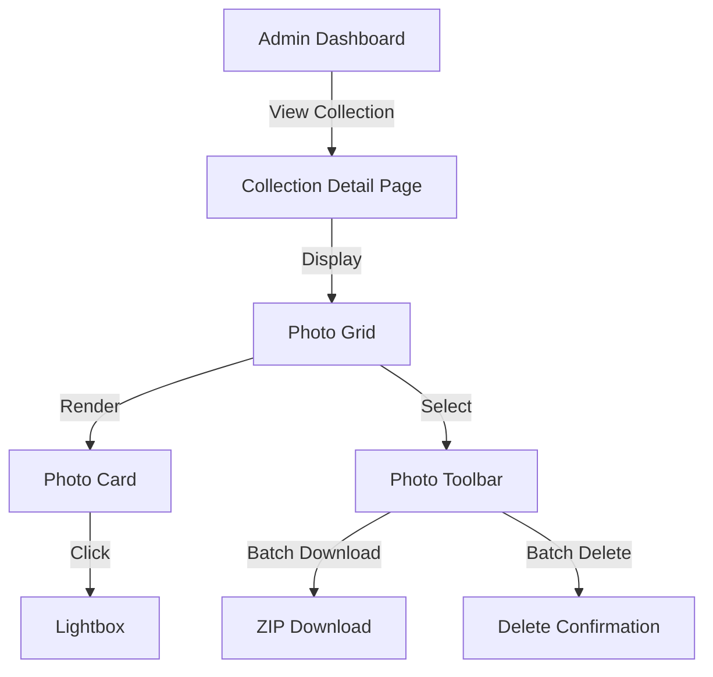

# Design Document - Phase 5: Admin UI Design

## Overview

This design implements a modern admin interface with focus on photo management. The UI follows contemporary dashboard patterns with responsive grid, lightbox viewer, and batch operations.

## Steering Document Alignment

### Technical Standards
- **Frontend Framework**: Vue 3 with Composition API
- **Styling**: Tailwind CSS utility-first approach
- **Icons**: Heroicons or Lucide (no emojis)
- **Design Style**: Modern admin dashboard (clean, professional)
- **Color Scheme**: Blue primary with neutral grays

### Project Structure
- Admin dashboard in `apps/web/src/pages/AdminDashboard.vue`
- Collection detail in `apps/web/src/pages/AdminCollectionDetail.vue`
- Photo grid in `apps/web/src/components/admin/PhotoGrid.vue`
- Photo card in `apps/web/src/components/admin/PhotoCard.vue`
- Lightbox in `apps/web/src/components/admin/Lightbox.vue`
- Toolbar in `apps/web/src/components/admin/PhotoToolbar.vue`
- Stat cards in `apps/web/src/components/admin/StatCard.vue`

## Code Reuse Analysis

### Existing Components to Leverage
- **Auth Store**: Use for authentication checks
- **API Service**: Extend for admin endpoints
- **Tailwind Config**: Use existing theme configuration
- **Router**: Add admin routes with guards

### Integration Points
- **Authentication**: Protect all admin routes
- **API**: Call admin endpoints for CRUD operations
- **File Download**: Implement ZIP streaming for batch downloads

## Architecture

## Components and Interfaces

### Frontend Components

#### 1. Admin Dashboard (`apps/web/src/pages/AdminDashboard.vue`)
- **Purpose**: Main admin landing page with statistics
- **Interfaces**:
  - Display stat cards (total collections, photos, storage)
  - List collection cards with click to detail
  - Show empty state if no collections
- **Dependencies**: API service, StatCard component
- **Reuses**: Auth store for authentication

#### 2. Collection Detail Page (`apps/web/src/pages/AdminCollectionDetail.vue`)
- **Purpose**: View and manage photos in a collection
- **Interfaces**:
  - Display collection info header
  - Render PhotoGrid component
  - Handle photo selection state
- **Dependencies**: PhotoGrid, PhotoToolbar
- **Reuses**: API service for photo fetching

#### 3. Photo Grid (`apps/web/src/components/admin/PhotoGrid.vue`)
- **Purpose**: Responsive grid layout for photos
- **Interfaces**:
  - Props: `photos: Photo[]`, `selectedIds: string[]`
  - Events: `@select`, `@click`
  - Grid: `grid-cols-2 md:grid-cols-4 lg:grid-cols-6`
- **Dependencies**: PhotoCard component
- **Reuses**: Tailwind responsive utilities

#### 4. Photo Card (`apps/web/src/components/admin/PhotoCard.vue`)
- **Purpose**: Individual photo display with selection
- **Interfaces**:
  - Props: `photo: Photo`, `selected: boolean`
  - Events: `@select`, `@click`
  - Features: Checkbox, hover overlay, thumbnail
- **Dependencies**: None
- **Reuses**: Tailwind hover states

#### 5. Lightbox (`apps/web/src/components/admin/Lightbox.vue`)
- **Purpose**: Full-screen photo viewer
- **Interfaces**:
  - Props: `photos: Photo[]`, `currentIndex: number`, `visible: boolean`
  - Events: `@close`, `@next`, `@prev`, `@download`, `@delete`
  - Keyboard: ESC (close), Arrow keys (navigate)
- **Dependencies**: None
- **Reuses**: Tailwind modal patterns

## Error Handling

### Error Scenarios

1. **Photo Load Failure**
   - **Handling**: Show placeholder image
   - **User Impact**: User sees broken image indicator

2. **Batch Download Failure**
   - **Handling**: Show error toast with retry option
   - **User Impact**: User can retry download

3. **Delete Confirmation Cancel**
   - **Handling**: Close dialog, no action taken
   - **User Impact**: Operation cancelled safely

## Testing Strategy

### Unit Testing
- Test component props and events
- Test selection state management
- Test keyboard navigation

### Integration Testing
- Test photo grid with API data
- Test batch operations
- Test lightbox navigation

### End-to-End Testing
- Test complete admin workflow
- Test batch download/delete
- Test keyboard shortcuts

