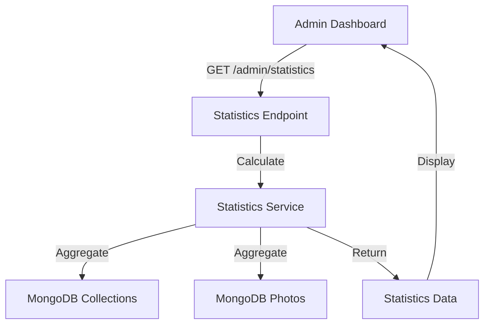

# Design Document - Phase 6: Statistics & Data Display

## Overview

This design implements statistics calculation and display for the admin dashboard. The system aggregates data from collections and photos to provide meaningful insights.

## Steering Document Alignment

### Technical Standards
- **Backend**: FastAPI with MongoDB aggregation
- **Frontend**: Vue 3 with reactive statistics display
- **Caching**: Optional Redis for statistics caching

### Project Structure
- Statistics service in `apps/api/app/services/statistics_service.py`
- Statistics endpoint in `apps/api/app/api/v1/admin.py`
- Statistics display in dashboard components

## Architecture



## Components and Interfaces

### Backend Components

#### Statistics Service (`apps/api/app/services/statistics_service.py`)
- **Purpose**: Calculate system and collection statistics
- **Interfaces**:
  - `get_system_statistics() -> dict`: Get system-wide stats
  - `get_recent_uploads(limit: int) -> List[dict]`: Get recent uploads
  - `get_collection_statistics(code: str) -> dict`: Get collection stats
- **Dependencies**: MongoDB aggregation
- **Reuses**: Collection and Photo models

## Data Models

### Statistics Response
```typescript
{
  total_collections: number,
  total_photos: number,
  total_storage_bytes: number,
  active_collections: number,
  recent_uploads: [{
    photo_id: string,
    collection_code: string,
    collection_name: string,
    thumbnail_path: string,
    uploaded_at: string
  }]
}
```

## Testing Strategy

### Unit Testing
- Test statistics calculation logic
- Test number formatting utilities
- Test aggregation queries

### Integration Testing
- Test statistics endpoint
- Test data accuracy

### End-to-End Testing
- Test dashboard statistics display
- Test statistics updates after uploads
