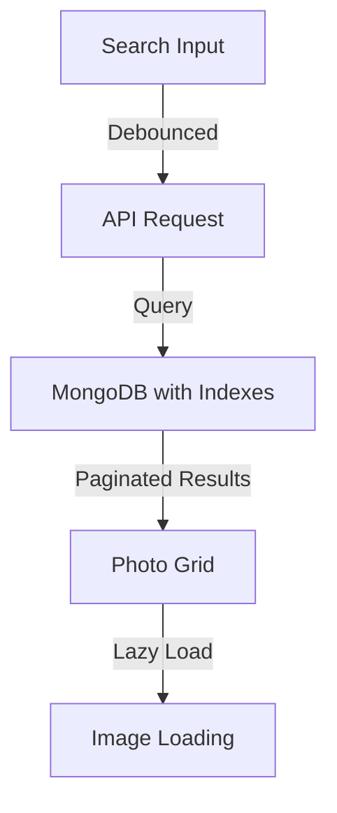

# Design Document - Phase 7: Search & Optimization

## Overview

This design implements search, filtering, and performance optimizations including database indexing, lazy loading, and query optimization.

## Architecture

## Components

### Backend
- Enhanced photo list endpoint with search/filter parameters
- Database indexes on filename and uploaded_at
- Pagination optimization

### Frontend
- Search input with debouncing
- Date range picker
- Lazy loading for images
- Virtual scrolling for large lists

## Testing Strategy

- Test search performance with large datasets
- Test lazy loading behavior
- Test pagination
