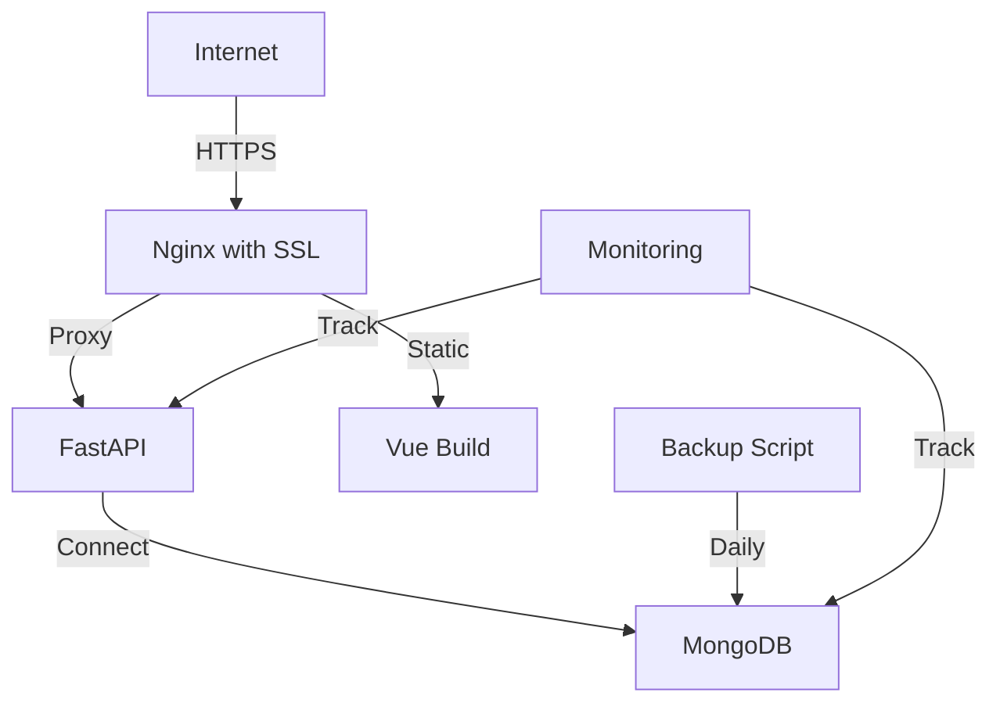

# Design Document - Phase 9: Production Deployment

## Overview

This design implements production deployment configuration with Docker optimization, HTTPS, backups, and monitoring.

## Architecture

## Components

### Production Docker
- Multi-stage builds for frontend and backend
- Optimized base images (alpine)
- Non-root users
- Health checks

### HTTPS Setup
- Nginx with Let's Encrypt
- Certbot for certificate management
- Auto-renewal cron job

### Backup System
- MongoDB dump script
- Cron job for daily backups
- Retention policy (30 days)

### Monitoring
- Structured logging (JSON)
- Log aggregation (optional: ELK stack)
- Health check endpoints
- Alert system (optional)

## Testing Strategy

- Test production Docker builds
- Test HTTPS configuration
- Test backup/restore procedures
- Test monitoring alerts
